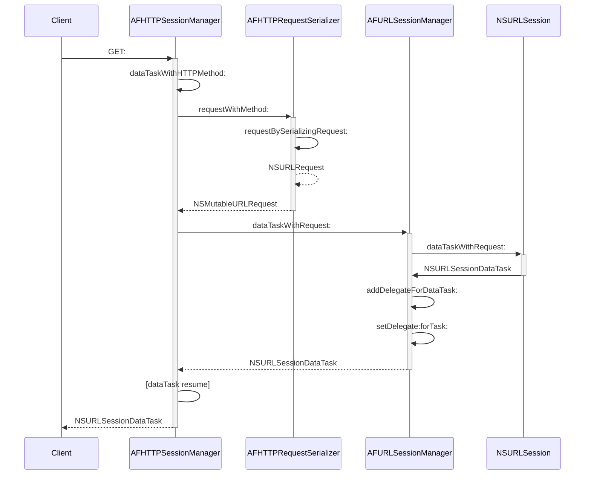
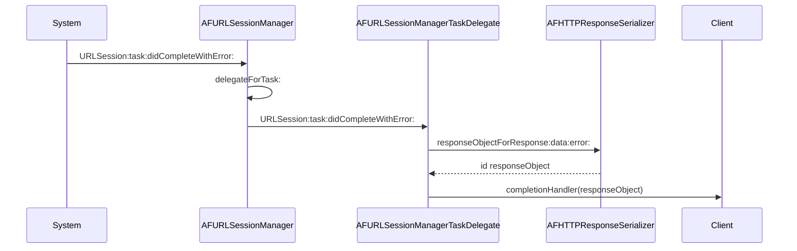

# AFNetworking

> [AFNetworking](https://github.com/AFNetworking/AFNetworking)

`AFURLSessionManager` creates and manages an `NSURLSession` object based on a specified `NSURLSessionConfiguration` object.

`AFHTTPSessionManager` is a subclass of `AFURLSessionManager` with convenience methods for making HTTP requests (by `baseURL` and relative paths).

> [HTTP request methods](https://developer.mozilla.org/en-US/docs/Web/HTTP/Methods)

Create and resume a task:

Data task did completed:

