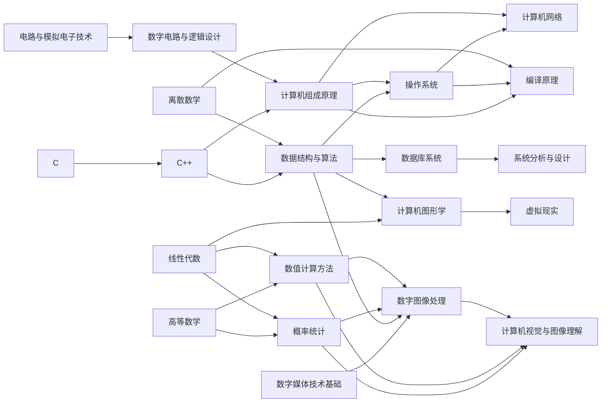

# 课程表

```mermaid
graph LR
    C --> C++ --> 数据结构与算法 --> 操作系统 --> 计算机网络
    C++ --> 计算机组成原理 --> 计算机网络
    计算机组成原理 --> 编译原理
    电路与模拟电子技术 --> 数字电路与逻辑设计 --> 计算机组成原理 --> 操作系统 --> 编译原理
    数字媒体技术基础 --> 数字图像处理
    数据结构与算法 --> 数字图像处理
    离散数学 --> 数据结构与算法 --> 数据库系统 --> 系统分析与设计
    离散数学 --> 编译原理
    高等数学 --> 概率统计 --> 数字图像处理
    线性代数 --> 概率统计 --> 计算机视觉与图像理解
    高等数学 --> 数值计算方法 --> 数字图像处理
    线性代数 --> 数值计算方法 --> 计算机视觉与图像理解
    数字图像处理 --> 计算机视觉与图像理解
    线性代数 --> 计算机图形学 --> 虚拟现实
    数据结构与算法 --> 计算机图形学
```

电子商务概论（商业规划与战略、创业家、供应链）、商业智能系统、信息安全、系统集成、系统分析与设计、项目管理等等。
