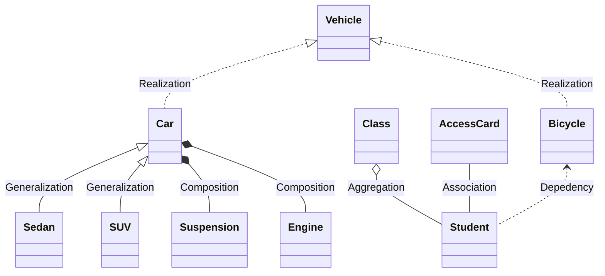

# 设计模式

面向对象的三个基本特征是：**封装**、**继承**、**多态**

一句话概括多态：子类重写了父类的方法，通过父类类型的指针调用了子类实例的方法，就是多态。

先说项目中用到了哪些设计模式，再说整个技术方案是如何遵循六大设计原则。

## UML 类图



下面我们介绍类之间的六种关系：

| 关系                | 表示                                                       | 含义                                                                                                                                       |
| ------------------- | ---------------------------------------------------------- | ------------------------------------------------------------------------------------------------------------------------------------------ |
| 实现 Realization    | 虚线加三角箭头                                             | 实现关系表现为继承抽象类/实现接口/实现协议。Vehicle 是一个抽象类/接口/协议，它不能被实例化，只有具体实现它的类 Car 和 Bicycle 可以实例化。 |
| 泛化 Generalization | 实线加三角箭头                                             | 继承关系也叫 is-a 的关系，例如 Sedan is a Car。                                                                                            |
| 组合 Composition    | 实心菱形箭头                                               | 表现为整体由部分构成，是一种强依赖关系，整体不存在了，则部分也不会存在。                                                                   |
| 聚合 Aggregation    | 空心菱形箭头                                               | 同样表现为整体由部分构成，是一种弱依赖关系，整体不存在了，部分依然存在。                                                                   |
| 关联 Association    | 一条直线表示，默认没有方向，如果特别强调方向，则加上箭头。 | 一般用来定义对象之间静态的、天然的结构，通常由常识等因素决定的，与运行状态无关。                                                           |
| 依赖 Dependency     | 虚线箭头，我们总是应该保持单向依赖，杜绝双向依赖的产生。   | 与关联关系不同的是，它是一种临时性的关系，通常在运行期间产生，并且可能随着运行时的变化发生变化。                                           |

## 设计模式

> [图说设计模式](https://design-patterns.readthedocs.io/zh_CN/latest/index.html)

### 创建型模式

创建型模式 (Creational Pattern) 对类的实例化过程进行了抽象，能够将软件模块中对象的创建和对象的使用分离。为了使软件的结构更加清晰，外界对于这些对象只需要知道它们共同的接口，而不清楚其具体的实现细节，使整个系统的设计更加符合单一职责原则。

简单工厂模式主要解决不同情况下，需要创建不同子类，而这些子类又需要转化为公共父类让外界去使用的问题。Foundation 框架中的 `NSNumber` 所应用的就是简单工厂模式。类似的还有 `NSArray`、`UIButton` 等。

```swift
let boolValue: Bool = true
let doubleValue: Double = 1.0
let boolN = NSNumber(value: boolValue)
let doubleN = NSNumber(value: doubleValue)
print(type(of: boolN)) // __NSCFBoolean
print(type(of: doubleN)) // __NSCFNumber
```

建造者模式是用来隔离复杂对象的配置过程，将复杂对象的配置过程单独封装成一个 builder 对象，完成配置后，再获取配置完成的实例对象。如`NSDateComponent`，`NSURLComponent`。

```swift
var components = URLComponents()
components.scheme = "https"
components.host = "api.github.com"
components.path = "/search/repositories"
components.queryItems = [
    URLQueryItem(name: "q", value: query),
    URLQueryItem(name: "sort", value: sorting.rawValue)
]
let url = components.url // 建造完成
```

单例模式：`URLSession.default`，`UserDefaults.standard`，`UIApplication.shared`。

### 结构型模式

结构型模式 (Structural Pattern) 描述如何将类或者对象结合在一起形成更大的结构，就像搭积木，可以通过简单积木的组合形成复杂的、功能更为强大的结构。

适配器模式：将一个类的接口转换成客户端希望的另外一个接口，适配器模式使得原本由于接口不兼容而不能一起工作的类可以一起工作。如，数据上报迁移过程中使用的两套接口。

组合模式就是将对象组合成树形结构，而且单个对象和组合对象的接口一致（同一个类）。数据结构中的树用 `TreeNode` 表示树的每个节点，就是组合模式。`UIView` 组成的视图层级、`CALayer` 组成的图层层级，是经典的组合模式。

在面向对象编程中，有时候一个类需要被创建多个对象，但当进程中对象数量太多时，将带来内存上涨、性能下降等问题。享元模式（Flyweight）通过共享技术实现相同或相似对象的重用。UIKit 中，`UITableViewCell` 和 `UICollectionViewCell` 的复用就是典型的享元模式。

代理模式：一个客户不想或者不能直接引用一个对象，此时可以通过一个称之为“代理”的第三者来实现间接引用，如 `NSProxy`。

### 行为型模式

行为型模式(Behavioral Pattern)是对在不同的对象之间划分责任和算法的抽象化。

职责链模式：`UIResponder`。

观察者模式：`NSNotificationCenter` 添加观察者 `addObserver:selector:name:object:`。

迭代器模式：`class NSEnumerator` 和 `protocol NSFastEnumeration`。

## 六大设计原则

单一职责原则（Single Responsibility Principle）：简单讲就是一个类只做一件事，`CALayer` 负责动画和视图的显示；`UIView` 负责事件传递、事件响应。

开闭原则（Open Closed Principle）：对修改关闭，对扩展开放。模块通过扩展的方式去应对需求的变化，应该尽量在不修改源代码的基础上面扩展组件。通过扩展去应对需求变化，就要求我们必须要面向接口编程，或者说面向抽象编程。所有参数类型、引用传递的对象必须使用抽象（接口或者抽象类）的方式定义，不能使用实现类的方式定义。总的来说，开闭原则提高系统的可维护性和代码的重用性。

里氏替换原则（Liskov Substitution Principle）：In a computer program, if S is a subtype of T, then objects of type T may be replaced with objects of type S without altering any of the desirable properties of the program (correctness, task performed, etc.) 父类可以被子类无缝替换，且原有的功能不受任何影响。

迪米特法则（Law Of Demeter）：一个对象应当对其他对象尽可能少的了解，实现高聚合、低耦合。

接口隔离原则（Interface Segregation Principle）：使用多个专门的协议、而不是一个庞大臃肿的协议，如 `UITableviewDelegate` 和 `UITableViewDataSource`。

依赖倒置原则（Dependence Inversion Principle）：抽象不应该依赖于具体实现、具体实现可以依赖于抽象。（调用接口感觉不到内部是如何操作的）

对这六个原则的遵守并不是是和否的问题，而是遵守程度的多少，要根据实际情况灵活运用。对他们的遵守程度只要在一个合理的范围内，就算是良好的设计。
