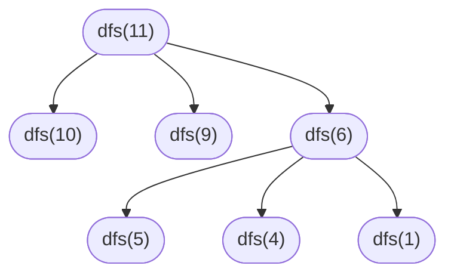

# 动态规划

## 递归与动态规划导论

### [509-斐波那契数](https://leetcode-cn.com/problems/fibonacci-number/)

斐波那契数列 [0, 1, 1, 2, 3, 5, 8, ...] 可以表示为递归形式：

```cpp
int fib(n) {
    if (n == 0) return 0;
    if (n == 1) return 1;
    return fib(n-1) + fib(n-2);
}
```

涉及递归的问题都可以画出递归树，对于分析算法复杂度、寻找算法低效的原因、找到高效的解法有很大帮助！假设求 fib(20)，画出递归树后会发现，这个递归存在着大量重复计算，假设 N = 20，那么树的高度是 20，树的节点数是 2 ^ N，算法复杂度是 O(2^n)，这太大了！


因此我们可以用一个数组或者哈希表存储已经计算过的结果，当遍历递归树遇到同样的节点时，就可以快速访问到结果而不必重复计算，这就是“剪枝”。通过剪枝，把一颗存在巨量冗余的递归树，变成了不存在冗余的递归图，fib(20) ... fib(1) 每个结果都只计算了一次。这就是“记忆化递归”！


递归的思路是把一个大问题，自顶向下分解成子问题，最后到达递归树的叶子结点，然后逐层返回计算结果。而动态规划的思想，是从最小子问题开始，即 f(1) 和 f(2)，自底向上，逐步构建出大问题的解。

```cpp
class Solution {
public:
    int fib(int n) {
        if (n <= 1) return n;
        vector<int> dp(n+1, 0);
        dp[1] = 1;
        for (int i = 2; i <= n; ++i) {
            dp[i] = dp[i-1] + dp[i-2];
        }
        return dp[n];
    }
};
```

### [322-零钱兑换](https://leetcode-cn.com/problems/coin-change/)

给定不同面额的硬币和一个目标金额，计算可以凑成目标金额的最少硬币个数；如果不能凑成目标金额，返回  -1。每一种硬币的数量不限。

递归方案，自顶向下思考。由于每一种硬币的数量不限，每一步都可以选择任意一枚硬币，这是一个 N 叉递归树的前序遍历。

举例：目标 11 元，硬币 [1, 2, 5]。最少硬币数 `dfs(11) = 1 + min(dfs(11-1), dfs(11-2), dfs(11-5))`



这个递归调用存在许多子问题被重复计算，因此我们需要一个缓存，来实现递归树的剪枝。

```cpp
class Solution {
public:
    int dfs(vector<int> &coins, int target, unordered_map<int, int> &um) {
        if (target < 0) return -1;
        if (target == 0) return 0;
        if (um.find(target) != um.end()) {
            return um[target];
        }
        int res = INT_MAX;
        for (int c : coins) {
            int cur = 1 + dfs(coins, target - c, um);
            if (cur > 0)
                res = min(res, cur);
        }
        um[target] = res == INT_MAX ? -1 : res;
        return um[target];
    }

    int coinChange(vector<int>& coins, int amount) {
        unordered_map<int, int> um;
        return dfs(coins, amount, um);
    }
};
```

动态规划问题的两个要素：最优子结构、状态转移方程。

- 最优子结构：问题的最优解，可以从其子问题的最优解构造出来。
- 状态转移方程：假设已知子问题的最优解 dp[0] ... dp[n-1]，如何得到问题的最优解 dp[n]。

如何找到最优子结构？——“问什么就设什么”。这道题目问的是凑成总金额 S 所需的最少的硬币个数。我们就设 F(S) 为组成金额 S 最少的硬币数。

画 N \* M 表格。N = len(coins) + 1，M = amount + 1。

第一行，什么硬币也不选。代表 dp 数组的初始状态。其中 dp[0] = 0，0 元不需要硬币。

第二行，选择 2 元硬币。对于 amount >= 2，`dp[i] = (1 + dp[i-2]) if dp[i-2] != -1 else -1`

第三行，选择 5 元硬币，对于 amount >= 5，要组合成 amount，可以用 1 + dp[i-5] 枚硬币，或者 dp[i] 枚硬币（继承上一行），结果应该是两者中较小的一个。得到状态转移方程 `dp[i] = min(dp[i], 1 + dp[i-c])`

```cpp
class Solution {
public:
    int coinChange(vector<int>& coins, int amount) {
        vector<int> dp(amount+1, -1);
        dp[0] = 0;
        for (int c : coins) {
            for (int i = c; i < amount+1; ++i) {
                if (dp[i-c] != -1) {
                    int res = dp[i-c] + 1;
                    dp[i] = dp[i] == -1 ? res : min(dp[i], res);
                }
            }
        }
        return dp[amount];
    }
};
```

### [518-零钱兑换 II](https://leetcode-cn.com/problems/coin-change-2/)

给定不同面额的硬币和一个目标金额，计算可以凑成目标金额的硬币组合数；如果不能凑成目标金额，返回 0。每一种硬币的数量不限。

这是一个典型的组合问题，对于每种硬币都有选与不选两种情况，且最后组成的金额可以拆分为更小的金额。这种大问题里嵌套子问题的，首先想到用动态规划解决。动态规划两步走——最优子结构（求什么就设什么）、状态转移方程（画表格）。

动态规划的过程就是一个填表格的过程，假设可用硬币为 [2, 5, 10]，计算 amount = 11 元的组合总数，M = len([2, 5, 10])，N = 11，画一个 M+1 行，N+1 列的表格。

填第一行，即什么硬币都不选。

填第二行，此时选择了硬币 [2]，对于 amount < 2，用 2 元硬币无法凑成，因此结果是直接继承上一行。对于 amount >= 2，则组合数 = 选择 2 元硬币的组合数 + 不选择 2 元硬币的组合数。

其中，不选择 2 元硬币的组合数 = dp[i]，继承上一行。选择 2 元硬币的组合数 = dp[i-2]。这是动态规划中重要的思想——前面计算的结果可以为后面所用。由于我们是从左往右遍历，我们已经计算出了 dp[i-2] 的组合数，dp[i] 的每种组合即 dp[i-2] 的每种组合加上一枚 2 元硬币。

因此我们得到了一个递推关系：`dp[i] = dp[i] + dp[i-coin]`

而且，在动态计算的过程中，dp[i] 的计算只与上一行有关，因此我们只需要一个长度为 amount+1 的数组作为存储即可。


```cpp
class Solution {
public:
    int coinChange(vector<int>& coins, int amount) {
        vector<int> dp(amount+1, -1);
        dp[0] = 0;
        for (int c : coins) {
            for (int i = c; i <= amount; ++i) {
                if (dp[i-c] != -1) {
                    int res = 1 + dp[i-c];
                    dp[i] = dp[i] == -1 ? res : min(dp[i], res);
                }
            }
        }
        return dp[amount];
    }
};
```

## 背包问题

### [背包问题](https://www.lintcode.com/problem/backpack/description)

给定不同大小的物品和一个背包，每个物品的大小为 A[i]，背包容量为 m，挑选物品装入背包，问最大能装多满？

动态规划，物品一个一个选，背包容量一点点增大。填表格时，因为每件物品只能选择一次，所以每一行要从右往左填，不能让左边填好的结果影响右边；填每一个格子时，可能上一行的结果更好，所以取的是 `max(dp[i], a + dp[i-a])`。

```cpp
class Solution {
public:
    int backPack(int m, vector<int> &A) {
        vector<int> dp(m+1, 0);
        for (int a : A) {
            for (int i = m; i >= a; --i) {
                dp[i] = max(dp[i], dp[i-a] + a);
            }
        }
        return dp[m];
    }
};
```

### [背包问题 II](https://www.lintcode.com/problem/backpack-ii/description)

给定不同大小的物品和一个背包，每个物品的大小为 A[i]、价值为 V[i]，背包容量为 m，挑选物品装入背包，问能装入背包的最大价值是多少？

```cpp
class Solution {
public:
    int backPackII(int m, vector<int> &A, vector<int> &V) {
        vector<int> dp(m + 1, 0);
        for (int i = 0; i < A.size(); ++i) {
            for (int j = m; j >= A[i]; --j) {
                dp[j] = max(dp[j], dp[j-A[i]] + V[i]);
            }
        }
        return dp[m];
    }
};
```

### [背包问题 III](https://www.lintcode.com/problem/backpack-iii/)

给定不同大小的物品和一个背包，每个物品的大小为 A[i]、价值为 V[i]，背包容量为 m，挑选物品装入背包，**每个物品可以选择不限次数**，问能装入背包的最大价值是多少？

```cpp
class Solution {
public:
    int backPackIII(vector<int> &A, vector<int> &V, int m) {
        vector<int> dp(m + 1, 0);
        for (int i = 0; i < A.size(); ++i) {
            for (int j = A[i]; j <= m; ++j) {
                dp[j] = max(dp[j], dp[j-A[i]] + V[i]);
            }
        }
        return dp[m];
    }
};
```

### [背包问题 IV](https://www.lintcode.com/problem/backpack-iv/description)

给定不同大小的物品和一个背包，每个物品的大小为 nums[i]，背包容量为 target，求能填满背包的方案数。每一个物品可以用无限次。

```cpp
class Solution {
public:
    int backPackIV(vector<int> &nums, int target) {
        vector<int> dp(target + 1, 0);
        dp[0] = 1;
        for (int num : nums) {
            for (int i = num; i <= target; ++i) {
                dp[i] += dp[i-num];
            }
        }
        return dp[target];
    }
};
```

### [背包问题 V](https://www.lintcode.com/problem/backpack-v/description)

给定不同大小的物品和一个背包，每个物品的大小为 nums[i]，背包容量为 target，求能填满背包的方案数。每一个物品只能用一次。

```cpp
class Solution {
public:
    int backPackV(vector<int> &nums, int target) {
        vector<int> dp(target + 1, 0);
        dp[0] = 1;
        for (int num : nums) {
            for (int i = target; i >= num; --i) {
                dp[i] += dp[i-num];
            }
        }
        return dp[target];
    }
};
```

### [背包问题 IX](https://www.lintcode.com/problem/800)

你总共有 n 万元，希望申请国外的大学，给出每个大学的申请费用、以及得到 offer 的概率。可以同时申请多所大学。找到至少获得一份 offer 的最大概率。

获得至少一份 offer 的概率 = 1 - 没有 offer 的概率。设 dp[i] 为花 i 元申请大学，没有 offer 的概率。

```cpp
class Solution {
public:
    double backpackIX(int n, vector<int> &prices, vector<double> &probability) {
        vector<double> dp(n+1, 1.0);
        for (int i = 0; i < prices.size(); ++i) {
            for (int j = n; j >= prices[i]; --j) {
                double noOffer1 = dp[j-prices[i]];
                double noOffer2 = 1 - probability[i];
                double noOffer = noOffer1 * noOffer2;
                dp[j] = min(dp[j], noOffer);
            }
        }
        return 1 - dp[n];
    }
};
```

## 动态规划

### 10-正则表达式

算法的设计是一个螺旋上升、逐步完善的过程，正则表达式匹配就是一个典型的例子。

先不考虑正则表达式，我们先看一个递归形式的字符串匹配，这个算法充分体现了递归的思想——递归函数返回的结果，被当下执行的函数所利用。或者说，管好当下，后面的交给递归去解决。

```python
def isMatch(s, p):
    if len(p) == 0: return len(s) == 0
    firstMatched = len(s) != 0 and p[0] == s[0]
    return firstMatched and isMatch(s[1:], p[1:]) ## 第一个字符相同，剩下的字符串同理。
```

然后我们处理 `.` 通配符（可以代表任何单个字符）：

```python
def isMatch(s, p):
    if len(p) == 0: return len(s) == 0
    ## 提示：一个短的正则表达式可以匹配很长的字符串，所以这里我们是检查 p[0] 是否在某些字符范围里
    firstMatched = len(s) != 0 and p[0] in {s[0], '.'}
    return firstMatched and isMatch(s[1:], p[1:])
```

然后我们处理 `*` 通配符：

```python
class Solution:
    def isMatch(self, s: str, p: str) -> bool:
        if len(p) == 0: return len(s) == 0
        firstMatched = len(s) != 0 and p[0] in {s[0], '.'}
        if len(p) >= 2 and p[1] == '*':
            ## 当前发现 * 通配符
            ## p[0] 匹配零次：self.isMatch(s, p[2:])
            ## p[0] 匹配第一个字符：firstMatched and self.isMatch(s[1:], p)
            return self.isMatch(s, p[2:]) or (firstMatched and self.isMatch(s[1:], p))
        else:
            return firstMatched and self.isMatch(s[1:], p[1:])
```

显然这个递归存在大量重复计算，用记忆化递归改造：

```python
class Solution:
    def isMatch(self, s: str, p: str) -> bool:
        cache = {}
        return self.match(s, p, 0, 0, cache)

    def match(self, s, p, i, j, cache):
        if j >= len(p): return i >= len(s)
        if (i, j) in cache:
            return cache[(i, j)]
        firstMatched = i < len(s) != 0 and p[j] in {s[i], '.'}
        if j < len(p) - 1 and p[j+1] == '*':
            cache[(i, j)] = self.match(s, p, i, j+2, cache) or (firstMatched and self.match(s, p, i+1, j, cache))
            return cache[(i, j)]
        else:
            cache[(i, j)] = firstMatched and self.match(s, p, i+1, j+1, cache)
            return cache[(i, j)]
```

本题也可以用动态规划解决。

一、最优子结构：dp[i][j] 表示 s 的前 i 个是否能被 p 的前 j 个匹配

二、状态转移方程：已知 dp[i-1][j-1]、s[i]、p[j]，如何求 dp[i][j]？

当 p[j] in {s[i], '.'}，则 dp[i][j] = dp[i-1][j-1]

考虑 \* 通配符，\* 的含义是匹配前面的字符零次或多次

p[j] == '\*' and p[j-1] == s[i] or p[j-1] == "."，\* 前面的字符可以匹配 N 次，……

p[j] == '\*' and p[j-1] != s[i]，\* 前面的字符匹配不上，只能匹配零次，则 dp[i][j] = dp[i][j-2]

```python
class Solution:
    def isMatch(self, s: str, p: str) -> bool:
        M = len(s)
        N = len(p)
        dp = [[False for _ in range(N+1)] for _ in range(M+1)]
        ## 初始化
        dp[0][0] = True
        for j in range(1, N+1):
            if p[j-1] == '*':
                dp[0][j] = dp[0][j-2]
        ## 计算
        for i in range(1, M+1):
            for j in range(1, N+1):
                if p[j-1] in {s[i-1], '.'}:
                    dp[i][j] = dp[i-1][j-1]
                elif p[j-1] == '*':
                    if p[j-2] in {s[i-1], '.'}:
                        dp[i][j] = dp[i][j-2] or dp[i-1][j-2] or dp[i-1][j]
                    else:
                        dp[i][j] = dp[i][j-2]
        return dp[M][N]
```

### [53-最大和子数组](https://leetcode-cn.com/problems/maximum-subarray/)

一、找最优子结构——问什么设什么，题目求的是最大和连续子数组**的和**，我们就设 dp[i] 为以 nums[i] 结尾的最大子数组和。

二、找状态转移方程——如果全是正数，那么最大和子数组就是 nums 全体。因为有负数的存在，而 dp[i] 是以 nums[i] 为结尾的，因此容易推出 dp[i] = nums[i] + (dp[i-1] if dp[i-1] > 0 else 0)

```cpp
class Solution {
public:
    int maxSubArray(const vector<int> &nums) {
        if (nums.empty())
            return 0;
        int res = nums[0];
        int N = static_cast<int>(nums.size());
        vector<int> dp(N);
        dp[0] = nums[0];
        for (int i = 1; i < N; ++i) {
            dp[i] = nums[i] + (dp[i-1] > 0 ? dp[i-1] : 0);
            res = std::max(dp[i], res);
        }
        return res;
    }
};
```

### [62-不同路径](https://leetcode-cn.com/problems/unique-paths/)

一个机器人位于一个 m x n 网格的左上角，每次只能向下或者向右移动一步。请问到达到网格的右下角总共有多少条不同的路径？

动态规划就是画表格，画表格就是动态规划。

```py
class Solution:
    def uniquePaths(self, m: int, n: int) -> int:
        dp = [[1 for i in range(n)] for i in range(m)]
        for i in range(1, m):
            for j in range(1, n):
                dp[i][j] = dp[i][j-1] + dp[i-1][j]
        return dp[m-1][n-1]
```

### [63-不同路径 II](https://leetcode-cn.com/problems/unique-paths-ii/)

一个机器人位于一个 m x n 网格的左上角，每次只能向下或者向右移动一步。请问到达到网格的右下角总共有多少条不同的路径？网格中有障碍物。

dp[i][j] 表示到达网格 [i][j] 的路径总数，dp[i][j] = dp[i-1][j] + dp[i][j-1]，填表格时，由左往右、由上往下，dp[i][j] 的结果取决于左一格和上一格，dp 二维数组可以优化为一维，数组长度为列数。

```py
class Solution:
    def uniquePathsWithObstacles(self, obstacleGrid: List[List[int]]) -> int:
        m = len(obstacleGrid)
        n = len(obstacleGrid[0])
        dp = [0 for i in range(n)]
        dp[0] = 1 if obstacleGrid[0][0] == 0 else 0
        for i in range(m):
            for j in range(n):
                if obstacleGrid[i][j] == 1:
                    dp[j] = 0
                    continue
                if j >= 1 and obstacleGrid[i][j-1] == 0:
                    dp[j] += dp[j-1]
        return dp[n-1]
```

### [64-最小路径和](https://leetcode-cn.com/problems/minimum-path-sum/)

一个机器人位于一个 m x n 网格的左上角，每个网格有一个非负整数，找出一条到右下角的路径，使得路径上的数字总和为最小。

### [72-编辑距离](https://leetcode-cn.com/problems/edit-distance/)

给定两个字符串，找到使得 s1 转换为 s2 所需的最小步数，每步可以插入、删除、替换一个字符。

一、最优子结构——dp[i][j] 代表 word1[:i] 转换成 word2[:j] 需要的最少步数。

二、状态转移方程——

- 当 word1[i] == word2[j]，dp[i][j] = dp[i-1][j-1]；
- 当 word1[i] != word2[j]，dp[i][j] = min(dp[i-1][j-1], dp[i-1][j], dp[i][j-1]) + 1。

第一行、第一列单独初始化：


```py
class Solution:
    def minDistance(self, word1: str, word2: str) -> int:
        M = len(word1)
        N = len(word2)
        dp = [[0 for _ in range(N+1)] for _ in range(M+1)]
        for i in range(1, M+1):
            dp[i][0] = i
        for j in range(1, N+1):
            dp[0][j] = j
        for i in range(1, M+1):
            for j in range(1, N+1):
                if word1[i-1] == word2[j-1]:
                    dp[i][j] = dp[i-1][j-1]
                else:
                    dp[i][j] = min(dp[i-1][j-1], dp[i-1][j], dp[i][j-1]) + 1
        return dp[M][N]
```

### [91-解码](https://leetcode-cn.com/problems/decode-ways/description/)

给定一个只包含数字的字符串，求解码方法的总数。（1 - A, 2 - B, ... 26 - Z）

一、最优子结构——设 dp[i] 为字符串 s[0...i] 的编码方法数。

二、状态转移方程。

- s[i] == '0'：如果与前一位组成 10 或 20，那么 dp[i] = dp[i-2]；否则无法解码（非法）。
- s[i] != '0'，如果与前一位组成 11 至 26 直接的数字，那么 dp[i] = dp[i-1] + dp[i-2]；否则 dp[i] = dp[i-1]。

```cpp
class Solution {
public:
    int numDecodings(const string &s) {
        if (s[0] == '0')
            return 0;
        vector<int> dp(s.size());
        dp[0] = 1;
        for (int i = 1; i < s.size(); ++i) {
            if (s[i] == '0') {
                if ((s[i - 1] == '1' || s[i - 1] == '2')) {
                    dp[i] = i >= 2 ? dp[i - 2] : 1;
                } else {
                    return 0;
                }
            } else {
                if (s[i - 1] == '1' || (s[i - 1] == '2' && s[i] >= '1' && s[i] <= '6')) {
                    dp[i] = dp[i - 1] + (i >= 2 ? dp[i - 2] : 1);
                } else {
                    dp[i] = dp[i - 1];
                }
            }
        }
        return dp.back();
    }
};
```

### [139-单词拆分](https://leetcode-cn.com/problems/word-break/)

这道题目起的是单词拆分，实际上还是一个组合问题。即给定一组单词和一个字符串，判断单词表里的单词能否组成字符串，每个单词可以使用无数次。

例如单词表 ["apple", "pen"]，字符串 "applepenapple"，返回 true。

最优子结构（求什么就设什么），设 dp[i] 为单词表能否组成 s[0:i]；

状态转移方程，每次转移的时候 s[i-1] 被包括进来，那么从 s[i-1] 向后遍历每一个位置 j，判断 s[j:i] 是否在单词表里；如果 s[0:j]、s[j:i] 都在单词表里，那么即满足条件！

```c
// 伪代码表示
dp["leetcode"] = dp["leetcod"] && "e" in wordDict
...
dp["leetcode"] = dp["leet"] && "code" in wordDict
```

```cpp
class Solution {
public:
    bool wordBreak(string s, vector<string>& wordDict) {
        int N = static_cast<int>(s.size());
        vector<bool> dp(N + 1, false);
        dp[0] = true;
        unordered_set<string> us(wordDict.begin(), wordDict.end()); // vector 构造 unordered_set
        for (int i = 0; i <= N; ++i) {
            for (int j = i - 1; j >= 0; --j) {
                dp[i] = dp[j] && (us.find(s.substr(j, i-j)) != us.end());
                if (dp[i]) break;
            }
        }
        return dp[N];
    }
};
```

### [279-完全平方数](https://leetcode-cn.com/problems/perfect-squares/description/)

给定一个正整数 n，找到若干个完全平方数（比如 1, 4, 9, 16, ...）使得它们的和等于 n。求最少的完全平方数个数。

### [300-最长上升子序列](https://leetcode-cn.com/problems/longest-increasing-subsequence/)

注意，子序列（subsequence）不一定是连续的；而子串、子数组（substring, subarray）是连续的。

一、找最优子结构——问什么就设什么，题目问的是找到最长上升子序列的长度，我们就设 dp[i] = 以 nums[i] 结尾的最⻓递增子序列的⻓度

二、找状态转移方程——`dp[i] = max(d[0] ... d[i-1]) + 1`

```cpp
class Solution {
public:
    int lengthOfLIS(vector<int>& nums) {
        int N = nums.size();
        vector<int> dp(N, 1);
        int res = 1;
        for (int i = 1; i < N; ++i) {
            for (int j = i - 1; j >= 0; --j) {
                if (nums[i] > nums[j]) {
                    dp[i] = max(dp[i], dp[j] + 1);
                }
            }
            res = max(res, dp[i]);
        }
        return res;
    }
};
```

### [343-整数拆分](https://leetcode-cn.com/problems/integer-break/description/)

给定一个正整数 n，将其拆分为至少两个正整数的和，并使这些整数的乘积最大化。求这个最大乘积。

最优子结构——设 dp[i] 为将 i 拆分后获得的最大乘积。

状态转移方程——当 i >= 2 时，可以至少拆分为两个正整数。令 j 是拆分出来的第一个整数，则剩下部分是 i - j，i - j 可以继续拆分，也可以不拆分，因此最大乘积是 `max(j * (i-j), j * dp[i-j])`。

```cpp
class Solution {
public:
    int integerBreak(int n) {
        vector<int> dp(n+1);
        if (n <= 1) return n;
        dp[0] = 1;
        dp[1] = 1;
        for (int i = 2; i <= n; ++i) {
            int ib = 0; // max product of breaking i
            for (int j = 1; j < i; ++j) {
                ib = max(ib, max(j * (i-j), j * dp[i-j]));
            }
            dp[i] = ib;
        }
        return dp[n];
    }
};
```

### [376-摆动序列](https://leetcode-cn.com/problems/wiggle-subsequence/)

给定一个整数数组，求最长摆动子序列的长度。摆动序列的定义：或者少于两个元素，或者相邻数字的差严格地在正数和负数之间交替。

### [413-等差数列](https://leetcode-cn.com/problems/arithmetic-slices/description/)

如果一个数列至少有三个元素，并且任意两个相邻元素之差相同，则称该数列为等差数列。给定一个整数数组，求数组中构成等差数列的子数组个数。（等差数列的 count >= 3）

设 `dp[i]` 为以 `nums[i]` 为结尾的等差子数组的个数。最终结果等于 `dp[0] + dp[1] + ... + dp[N-1]`。

每次转移，如果 nums[i] 与前两个数构成等差数列，那么 `dp[i] = dp[i-1] + 1`，这个 +1 意义是：


```cpp
class Solution {
public:
    int numberOfArithmeticSlices(vector<int>& nums) {
        size_t N = nums.size();
        vector<int> dp(N);
        if (N <= 2) return 0;
        int res = 0;
        for (int i = 2; i < N; ++i) {
            if (nums[i] - nums[i-1] == nums[i-1] - nums[i-2]) {
                dp[i] = dp[i-1] + 1;
            } else {
                dp[i] = 0;
            }
            res += dp[i];
        }
        return res;
    }
};
```

### [416-分割等和子集](https://leetcode-cn.com/problems/partition-equal-subset-sum/)

给定一个数组，是否可以将其分割成两个子集，使得两个子集的元素和相等。

首先，可以这样分割的前提是，这些数的总和是偶数。然后，题目转化为了经典的子集和问题（是否存在子集，元素和等于 sum 的一半）。

假设分割 [1,2,3,4] 这个集合，M = len(nums)，N = S/2，我们需要一个 M+1 行 N+1 列的表格。

填第一行，即什么都不选。

填第二行，此时选择了 [1]，对于 amount < 1，直接继承上一行。对于 amount >= 1，不选择 1 则 dp[i] = dp[i] 继承上一行，选择 1 则 dp[i] = dp[i-1]，因此 dp[i] = dp[i] or dp[i-1]。


特别地，因为此题中每个数字只能选择一次，因此在填写第二行时应该是从右往左填写，因为左边的结果是已经选择了 [1] 得到的，不能让左边的结果影响到右边。

```cpp
class Solution {
public:
    bool canPartition(vector<int>& nums) {
        int S = accumulate(nums.begin(), nums.end(), 0);
        if (S & 1) return false;
        S = S / 2;
        vector<bool> dp(S + 1, false);
        dp[0] = true;
        for (int num : nums) {
            for (int i = S; i >= num; --i) {
                dp[i] = dp[i] or dp[i-num];
            }
        }
        return dp[S];
    }
};
```

### [435-无重叠区间](https://leetcode-cn.com/problems/non-overlapping-intervals/)

给定一组区间，找到需要移除区间的最小数量，使剩余区间互不重叠。

首先分析题目，求最值，首先想到动态规划。动态规划就是求最值的，因为最值的产生肯定存在某种递推关系，前面计算的结果可以为后面所用。

然后，题目求的是需要移除区间的最小数量，就等同于求无重叠区间的最大个数。这个问题在生活中的应用广泛，比如你今天有好几个活动，每个活动都可以用区间 [start, end] 表示开始和结束的时间，显然你不能同时参加两个活动，请问你今天最多能参加几个活动呢？

然后，无重叠区间的特征是，在数轴上，后一个区间的起点不小于前一个区间的终点。这不就是上一道题——最长上升子序列吗？！我们需要先对区间们进行排序。

一、找最优子结构——问什么就设什么。设 dp[i] 为**以第 i 个区间为结尾的最大不重叠区间个数**。

二、找状态转移方程——求 dp[i] 时，前面任何一个区间都有可能与第 i 个区间重叠，我们需要找到 j < i 且 intervals[j] 与 intervals[i] 不发生重叠的所有 dp[j] 中的最大值。

有了动态规划思路后，写出代码，执行后发现非常耗时，原因是需要每次求 dp[i] 都需要遍历 dp[0...i]。

```cpp
bool compare(const vector<int> &lhs, const vector<int> &rhs) {
    return lhs[1] < rhs[1];
}

class Solution {
public:
    int eraseOverlapIntervals(vector<vector<int>>& intervals) {
        std::sort(intervals.begin(), intervals.end(), compare);
        int N = intervals.size();
        if (N == 0) return 0;
        vector<int> dp(N, 1);
        int res = 1;
        for (int i = 1; i < N; ++i) {
            for (int j = i - 1; j >= 0; --j) { // 耗时的原因
                if (intervals[j][1] <= intervals[i][0]) {
                    dp[i] = max(dp[i], dp[j] + 1);
                }
            }
            res = max(res, dp[i]);
        }
        return N - res;
    }
};
```

如何优化呢？在上面的解法中，dp[i] 代表包括第 i 个区间的解。这次，我们设 dp[i] 为“当前最优解”，它包括两种情况：

- `intervals[i]` 出现在无重叠区间里。我们可以在找到第一个不重叠的区间后停止遍历，因为这个区间的终点大于等于前面所有的终点！此时 `dp[i] = dp[j] + 1`，因为 dp[j] 存储了直到第 j 个区间的最优解！
- `intervals[i]` 不出现在无重叠区间里。此时 dp[i] 直接继承上一个最优解，`dp[i] = dp[i-1]`。

最终的 dp[i] 应该是两者中的较大值。

```cpp
bool compare(const vector<int> &lhs, const vector<int> &rhs) {
    return lhs[1] < rhs[1];
}

class Solution {
public:
    int eraseOverlapIntervals(vector<vector<int>>& intervals) {
        std::sort(intervals.begin(), intervals.end(), compare);
        int N = intervals.size();
        if (N == 0) return 0;
        vector<int> dp(N, 1);
        for (int i = 1; i < N; ++i) {
            for (int j = i - 1; j >= 0; --j) {
                if (intervals[j][1] <= intervals[i][0]) {
                    dp[i] = dp[j] + 1;
                    break;
                }
            }
            dp[i] = max(dp[i], dp[i-1]);
        }
        return N - dp[N-1];
    }
};
```

贪心算法，简单地说就是：每一步都做出一个局部最优的选择，最终的结果恰好就是全局最优。

贪心算法是动态规划算法的一个特例，相比动态规划，贪心算法需要满足的条件更加严苛，但是效率比动态规划要高。是否满足贪心算法的条件，要根据题目的特征来判断。

比如有 100 个硬币，你只能拿 10 个，如何拿到最大值？每次都选择剩余硬币中面额最大的（局部最优），最后的结果恰好是全局最优。

这道题是可以用贪心算法实现的。

### [474-一和零](https://leetcode-cn.com/problems/ones-and-zeroes/)

给定不同的“01”字符串数组，计算最多有 m 个 0 和 n 个 1 的最大子集的大小。

例如 ["10", "0001", "111001", "1", "0"], m = 5, n = 3；最大子集是 {"10","0001","1","0"}，答案为 4。

最优子结构：设 `dp[i][j]` 为 i 个 0 和 j 个 1，最多能拼出的字符串数目。

状态转移方程：枚举每个字符串，对每个字符串，都有两种选择：

- 不选则 `dp[i][j]` 保持不变；
- 选则 `dp[i][j] = 1 + dp[i-cnt0][j-cnt1];`（1 代表当前枚举的字符串本身）。

```cpp
class Solution {
public:
    int findMaxForm(vector<string>& strs, int m, int n) {
        vector<vector<int>> dp(m+1, vector<int>(n+1));
        for (const string &s : strs) {
            int cnt0 = count(s.begin(), s.end(), '0');
            int cnt1 = count(s.begin(), s.end(), '1');
            for (int i = m; i >= cnt0; --i) {
                for (int j = n; j >= cnt1; --j) {
                    dp[i][j] = max(dp[i][j], 1 + dp[i-cnt0][j-cnt1]);
                }
            }
        }
        return dp[m][n];
    }
};
```

### [494-目标和](https://leetcode-cn.com/problems/target-sum/)

给定一个数组（非负）和一个目标数，对于数组中任意一个数你可以选择符号 + 或 -，问有多少种方法使得和为目标数。

我们把这个数组分为 A 和 B 两部分，对 A 全部取 +，对 B 全部取 -，则应满足 sum(A) - sum(B) = target。

等式两边各加上 2 \* sum(B)，得到 sum(A) + sum(B) = target + sum(B)，其中 sum(A) + sum(B) 就是数组所有数的和。

于是我们将问题转化为：是否存在一个子集 B，使得 sum(nums) = target + 2 \* sum(B)。接下来的思路就和分割等和子集一样了。

```cpp
class Solution {
public:
    int findTargetSumWays(vector<int>& nums, int S) {
        int target = S;
        S = accumulate(nums.begin(), nums.end(), 0);
        if ((S - target) & 1) return 0;
        target = (S - target) / 2;
        if (target < 0) return 0;
        vector<int> dp(target + 1, 0);
        dp[0] = 1;
        for (int num : nums) {
            for (int i = target; i >= num; --i) {
                dp[i] += dp[i-num];
            }
        }
        return dp[target];
    }
};
```

### [583-使两个字符串相同](https://leetcode-cn.com/problems/delete-operation-for-two-strings/)

给定两个字符串，找到使得它们相同的最小步数，每步可以删除任意一个字符串中的一个字符。

分别删除两个字符串中的字符使它们一样，实际上就是上一题的问题——找最长公共子序列。找到了 LCS，把其它字符删掉就可以了。

```py
class Solution:
    def minDistance(self, word1: str, word2: str) -> int:
        M = len(word1)
        N = len(word2)
        dp = [[0 for _ in range(N+1)] for _ in range(M+1)]
        for i in range(1, M+1):
            for j in range(1, N+1):
                if word1[i-1] == word2[j-1]:
                    dp[i][j] = dp[i-1][j-1] + 1
                else:
                    dp[i][j] = max(dp[i-1][j], dp[i][j-1])
        lcs = dp[M][N]
        res = M + N - lcs * 2
        return res
```

### [646-最长数对链](https://leetcode-cn.com/problems/maximum-length-of-pair-chain/)

给定 n 个数对 (a, b)，其中 a < b。求最长数对链的长度。当 b < c 时，(c, d) 可以跟在 (a, b) 后面形成链。

### [650-复制粘贴字符](https://leetcode-cn.com/problems/2-keys-keyboard/)

记事本上有一个字母 'A'，求最少的操作次数，在记事本中输出恰好 N 个 'A'。每一次操作可以复制全部或者粘贴。

### [718-最长重复子数组](https://leetcode-cn.com/problems/maximum-length-of-repeated-subarray/)

给定两个数组，返回两个数组中公共的、长度最长的子数组的长度。

一、找最优子结构——问什么就设什么，设 dp[i][j] = **以 A[i-1] 和 B[j-1] 为结尾** 的最长重复子数组的长度。

二、找状态转移方程。两个数组一个作为行，一个作为列，画出表格。


由于子数组需要连续，因此 `dp[i][j] = A[i-1] == B[j-1] ? (dp[i-1][j-1] + 1) : 0`

```cpp
class Solution {
public:
    int findLength(vector<int>& A, vector<int>& B) {
        int M = A.size();
        int N = B.size();
        vector<vector<int>> dp(M+1, vector<int>(N+1));
        int res = 0;
        for (int i = 1; i <= M; ++i) {
            for (int j = 1; j <= N; ++j) {
                if (A[i-1] == B[j-1]) {
                    dp[i][j] = dp[i-1][j-1] + 1;
                }
                res = max(res, dp[i][j]);
            }
        }
        return res;
    }
};
```

### [887-鸡蛋掉落](https://leetcode-cn.com/problems/super-egg-drop/)

K 个鸡蛋，N 层楼，找到 F 满足任何从高于 F 的楼层落下的鸡蛋都会碎，从 F 楼层或比它低的楼层落下的鸡蛋都不会破。确定 F 的值的最小移动次数是多少？

如果只有一个鸡蛋，那么我们没有试错的机会，只能从第一层开始逐层尝试，需要尝试 N 次。

初始状态可以用 (K, N) 表示。当我们从 X 层扔下鸡蛋，如果鸡蛋破碎，则状态变为 (K-1, X-1)；如果鸡蛋完好，则状态变为 (K, N-X)。

我们可以穷举 X，并找到次数最少的移动方法，每一步的 X 即代表了应该从哪一层扔下鸡蛋。


```python
class Solution:
    def superEggDrop(self, K: int, N: int) -> int:
        ## 如果我们只有一个鸡蛋，那么我们必须从第一层开始，逐层尝试，因为鸡蛋一旦打破，就没有鸡蛋再试，我们就无法找到问题的解。
        ## 因此在最坏情况下，我们需要尝试 N 次才得到问题的解。
        if K == 1: return N
        if N == 0: return 0 ## 边界条件
        res = float('INF') ## 取一个最大值
        ## 对于任意楼层 1 <= i <= N，存在两种情况，从 i 层扔下鸡蛋，摔碎或者没摔碎。
        for i in range(1, N+1):
            ## 在第 i 层摔碎了，鸡蛋数量-1，需尝试楼层变为 i-1
            broken = self.superEggDrop(K-1, i-1)
            ## 在第 i 层没摔碎，鸡蛋数量不变，需尝试楼层变为 N-i
            good = self.superEggDrop(K, N-i)
            ## 需考虑最坏情况下的移动次数，因此应该取两种情况下次数的较大者，再加上从 i 层扔下的这一次本身
            res = min(res, max(broken, good) + 1)
        return res
```

上述的代码可以计算出结果，但显然这个递归存在大量的重复计算，因此我们很自然地要用记忆化递归：

```python
class Solution:
    cache = {}
    def superEggDrop(self, K: int, N: int) -> int:
        if K == 1: return N
        if N == 0: return 0
        if (K, N) in self.cache:
            return self.cache[(K, N)]
        res = float('INF')
        for i in range(1, N+1):
            ## 在第 i 层摔碎了，鸡蛋数量 -1，楼层从 i-1 层继续尝试
            broken = self.superEggDrop(K-1, i-1)
            ## 在第 i 层没摔碎，鸡蛋数量不变，楼层从 i+1 层继续尝试
            good = self.superEggDrop(K, N-i)
            res = min(res, max(broken, good) + 1)
        self.cache[(K, N)] = res
        return res
```

经过改造后，减少了大量的重复计算，但是针对 K = 4，N = 2000 这种测试用例时，仍然会超时，且超出了 python3 的默认最大递归深度。我们还需要更优化的方法。

解题的亮点来了，我们之前采用的方法是穷举 X，注意 dp(K-1, X-1) 和 dp(K, N-X) 这两个函数，如果 K, N 固定，把这两个函数看作关于 X 的函数，那么 dp(K-1, X-1) 是在第一象限的单调递增函数，而 dp(K, N-X) 是在第一象限的单调递减函数。


max(dp(K-1, X-1), dp(K, N-X)) 是图中红色的线，这条线上的最小值就是此题的解。很显然，我们并不需要穷举 X，只需要二分查找 X 即可：

```py
class Solution:
    cache = {}
    def superEggDrop(self, K: int, N: int) -> int:
        if K == 1: return N
        if N == 0: return 0
        if (K, N) in self.cache:
            return self.cache[(K, N)]
        res = float('INF')
        lo = 1
        hi = N
        while lo <= hi:
            mid = (lo + hi) // 2
            broken = self.superEggDrop(K-1, mid-1)
            good = self.superEggDrop(K, N-mid)
            if broken > good:
                hi = mid - 1
                res = min(res, broken + 1)
            else:
                lo = mid + 1
                res = min(res, good + 1)
        self.cache[(K, N)] = res
        return res
```

### [1143-最长公共子序列](https://leetcode-cn.com/problems/longest-common-subsequence/)

最长公共子序列（Longest common subsequence），是指字符串 text1 和 text2 共同拥有的子序列。

首先，先写出基础的递归方法：

```python
class Solution:
    def longestCommonSubsequence(self, text1: str, text2: str) -> int:
        return self.dfs(text1, text2, 0, 0)

    def dfs(self, text1, text2, i, j):
        if i == len(text1) or j == len(text2):
            ## 到达字符串末尾
            return 0
        if text1[i] == text2[j]:
            ## 找到一个公共字符
            return self.dfs(text1, text2, i+1, j+1) + 1
        else:
            left = self.dfs(text1, text2, i+1, j) ## text1[i] 不在 LCS 中的情况
            right = self.dfs(text1, text2, i, j+1) ## text2[j] 不在 LCS 中的情况
            return max(left, right) ## 两者取较大值
```

这个递归方法存在着大量的重复计算，递归树的高度 N = min(len(text1), len(text2))，算法复杂度为 O(2^N)，这太大了，我们还是尝试用记忆化递归的方式来剪枝。

```python
## 结果：1992 ms, 在所有 Python3 提交中击败了 5.03% 的用户。
class Solution:
    def longestCommonSubsequence(self, text1: str, text2: str) -> int:
        cache = {}
        return self.dfs(text1, text2, 0, 0, cache)

    def dfs(self, text1, text2, i, j, cache):
        if i == len(text1) or j == len(text2):
            ## 到达字符串末尾
            return 0
        if (i, j) in cache:
            return cache[(i, j)]
        if text1[i] == text2[j]:
            ## 找到一个公共字符
            cache[(i, j)] = self.dfs(text1, text2, i+1, j+1, cache) + 1
            return cache[(i, j)]
        else:
            cache[i+1, j] = self.dfs(text1, text2, i+1, j, cache) ## text1[i] 不在 LCS 中的情况
            cache[i, j+1] = self.dfs(text1, text2, i, j+1, cache) ## text2[j] 不在 LCS 中的情况
            cache[i, j] = max(cache[i+1, j], cache[i, j+1])
            return cache[i, j] ## 两者取较大值
```

考虑用动态规划，自底向上构建出问题的解。

一、找最优子结构——问什么就设什么，设 dp[i][j] = text1[0...i-1] 与 text2[0...j-1] 的最长公共子序列的长度，表格如下：

二、找状态转移方程。

对于 s1 和 s2 中的每个字符，有两种选择，要么在 LCS 中，要么不在。

如果 s1[i-1] == s2[j-1]，那么这是一个公共字符，`dp[i][j] = dp[i-1][j-1] + 1`


反之，s1[i-1]、s2[j-1] 至少有一个不在 LCS 中，`dp[i][j] = max(dp[i-1][j], dp[i][j-1])`


```py
class Solution:
    def longestCommonSubsequence(self, text1: str, text2: str) -> int:
        M = len(text1)
        N = len(text2)
        dp = [[0 for i in range(N+1)] for i in range(M+1)]
        for i in range(1, M+1):
            for j in range(1, N+1):
                if text1[i-1] == text2[j-1]:
                    dp[i][j] = dp[i-1][j-1] + 1
                else:
                    dp[i][j] = max(dp[i-1][j], dp[i][j-1])
        return dp[M][N]
```

### [1478-分配邮筒](https://leetcode-cn.com/problems/allocate-mailboxes/)

houses[i] 代表第 i 个房子在一条街上的位置，现需要在这条街上安排 k 个邮筒，求每栋房子与离它最近的邮筒之间的距离的最小总和。

这道题是很明显的动态规划题，房子一个一个选，邮筒一个一个增加。在给动态规划画表格的时候，哪个是行哪个是列呢？我发现一个规律，列的元素在数轴上是连续的，比如背包容量、本题中的邮筒数量。行的元素可以不连续的，比如硬币的选择、本题中房子的位置等。

因此，可设最优子结构 dp[i][j] 为 house[0...i] 分配 j 个邮筒的距离最小总和。

## 股票交易

### [121-买卖股票](https://leetcode.com/problems/best-time-to-buy-and-sell-stock/)

给定一组股票价格，只能买卖一次，求最大收益。

在一次遍历中，记录最低的价格，动态计算最大差值即可。

```cpp
class Solution {
public:
    int maxProfit(vector<int>& prices) {
        int minPrice = prices[0];
        int res = 0;
        for (int i = 0; i < prices.size(); ++i) {
            res = max(res, prices[i] - minPrice);
            minPrice = min(minPrice, prices[i]);
        }
        return res;
    }
};
```

### [122-买卖股票 II](https://leetcode.com/problems/best-time-to-buy-and-sell-stock-ii/)

给定一组股票价格，买卖次数不限，求最大收益。买入股票前，必须先卖出持有的。

只要第二天的价格比第一天的高，就可以获取一次价差。

```cpp
class Solution {
public:
    int maxProfit(vector<int>& prices) {
        int res = 0;
        for (int i = 1; i < prices.size(); ++i) {
            if (prices[i] > prices[i-1]) {
                res += prices[i] - prices[i-1];
            }
        }
        return res;
    }
};
```

### [123-买卖股票 III](https://leetcode.com/problems/best-time-to-buy-and-sell-stock-iii/)

给定一组股票价格，只能交易两次，求最大收益。买入股票前，必须先卖出持有的。
