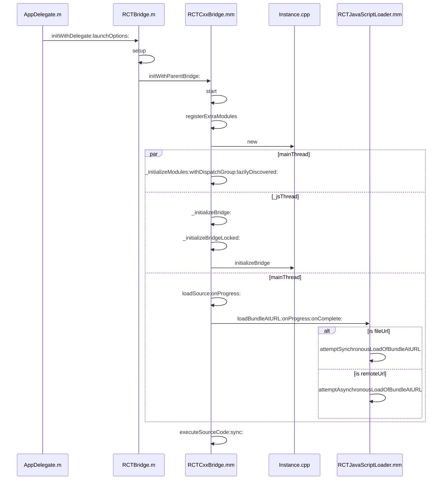
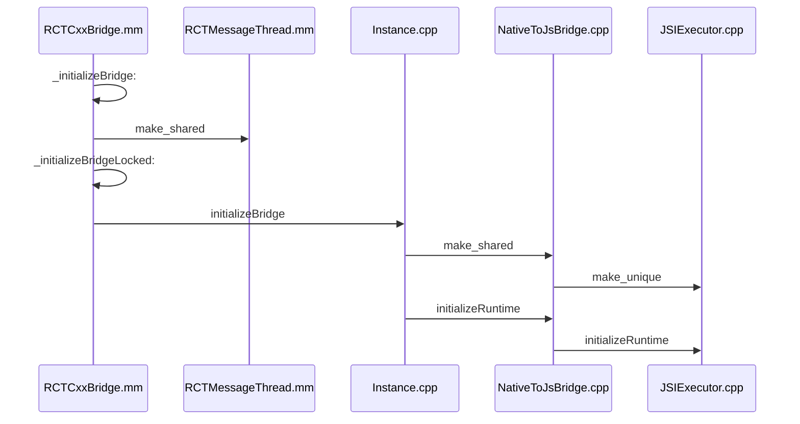

# React

## JavaScript

[A re-introduction to JavaScript (JS tutorial)](https://developer.mozilla.org/en-US/docs/Web/JavaScript/A_re-introduction_to_JavaScript)

JavaScript is designed to run as a scripting language in a **host environment**. The most common host environment is the **browser**, but JavaScript **interpreters** can also be found in a huge list of other places, including server-side environments such as **Node.js**.

**Types**: `Number`, `String`, `Boolean`, `Object` (`Function`, `Array`, `Date`, `RegExp`), `Symbol` (new in ES2015), `null`, `undefined`.

**Variables**: In JavaScript, blocks do not have scope; only functions have a scope. So if a variable is defined using `var` in a compound statement (for example inside an if control structure), **it will be visible to the entire function**. However, starting with ECMAScript 2015, `let` and `const` declarations allow you to create block-scoped variables.

- `let` allows you to declare block-level variables
- `const` allows you to declare block-level variables whose values are never intended to change
- `var` is available from the function it is declared in

JavaScript **objects** can be thought of as simple collections of name-value pairs. The "name" is a JavaScript string, while the value can be any JavaScript value.

JavaScript provides a mechanism for simultaneously declaring and invoking a function using a single expression. It’s called an Immediately invoked function expression (IIFE), and the syntax for using it with an **anonymous function** looks like this:

```js
(function () {
  // …
})();
```

JavaScript is a prototype-based language that contains no `class` statement. Instead, since functions are objects, [**JavaScript uses functions as classes**](https://developer.mozilla.org/en-US/docs/Web/JavaScript/A_re-introduction_to_JavaScript#custom_objects).

The keyword `new` creates a brand new empty object, and then calls the function `Person`, with `this` set to that new object. Functions that are designed to be called by `new` are called **constructor functions**.

```js
function Person(first, last) {
  this.first = first;
  this.last = last;
}
Person.prototype.fullName = function () {
  return this.first + " " + this.last;
};
Person.prototype.fullNameReversed = function () {
  return this.last + ", " + this.first;
};

var s = new Person("Simon", "Willison");
```

`Person.prototype` is an object shared by all instances of Person. It forms part of a **prototype chain**: any time you attempt to access a property of `Person` that isn't set, JavaScript will check `Person.prototype` to see if that property exists there instead. The root of this lookup chain is `Object.prototype`.

iOS 7（2013），苹果公司开放了 JavaScriptCore（解释执行 JavaScript 代码的引擎）。正是由于它的桥梁作用，出现了很多基于 JavaScriptCore 开发 App 的框架 ，比如 [Cordova](https://cordova.apache.org/)，[ionic](https://github.com/ionic-team/ionic-framework)（2013）、[React Native](https://github.com/facebook/react-native)（2015）、[Weex](https://github.com/apache/incubator-weex)（2016）、小程序（2017）等框架。

## Node.js

[Node.js](https://nodejs.org/dist/latest-v16.x/docs/api/)® is a JavaScript runtime built on Chrome's V8 JavaScript engine.

安装：`brew install node`

进入 REPL (read–eval–print loop)：`node`

退出 REPL：`.exit`

## npm

[npm](https://docs.npmjs.com/cli/v7/commands/npm): Javascript package manager.

[Yarn](https://engineering.fb.com/2016/10/11/web/yarn-a-new-package-manager-for-javascript/): A new package manager for JavaScript.

更新 npm 至最新版本：`npm install -g npm`

如果项目具有 `package.json` 文件，则运行 `npm install` 会在 `node_modules` 文件夹中安装其中声明的 packages。

运行 `npm install lodash` 会将软件包安装到当前目录的 `node_modules` 文件夹下，并在当前文件夹中的 `package.json` 的 `dependencies` 中添加 `lodash` 条目。

运行 `npm install -g lodash` 会将软件包安装到全局的位置，`npm root -g` 命令会告知其在计算机上的确切位置。

用户配置文件：`npm config get userconfig` 查看配置文件路径。

设置代理，同时，也会在 `~/.npmrc` 中更新这两条配置项。

```bash
npm config set proxy "http://127.0.0.1:7890"
npm config set https-proxy "http://127.0.0.1:7890"
```

查看配置项：`npm config list`

`package.json` 文件支持一种用于指定[命令行任务](http://nodejs.cn/learn/an-introduction-to-the-npm-package-manager)的格式：

```json
{
  "scripts": {
    "start-dev": "node lib/server-development",
    "start": "node lib/server-production"
  }
}
```

可通过使用以下方式运行：`npm run start`、`npm run start-dev`

## React

[React](https://reactjs.org/): A JavaScript library for building user interfaces.

The React homepage contains a few small React examples with a live editor. Have a try!

[Learn by doing](https://reactjs.org/tutorial/tutorial.html), [learn concepts from the ground up](https://reactjs.org/docs/hello-world.html), complementary to each other.

[React Tutorial: An Overview and Walkthrough](https://www.taniarascia.com/getting-started-with-react/)

### Learn by doing

创建工程：`npx create-react-app my-app`

By default, [npx](https://www.npmjs.com/package/npx) is a package runner tool that comes with npm. It will check whether `command` exists in `$PATH`, or in the local project binaries `node_modules/.bin`, and execute that. If `command` is not found, it will be installed prior to execution.

```bash
cd my-app
npm start
```

[`npm start`](https://docs.npmjs.com/cli/v7/commands/npm-start): This runs a predefined command specified in the "start" property of a package's "scripts" object.

Run the app in the development mode. The page will reload if you make edits. You will also see any lint errors in the console. 通过查看 `package.json` 文件发现运行的是 `react-scripts start` 指令，位于 `node_modules/.bin`。

如果顺利的话，现在 React 服务会在本机启动。Create React App doesn’t handle backend logic or databases; it just creates a frontend build pipeline, so you can use it with any backend you want. Under the hood, it uses Babel and webpack.

When you’re ready to deploy to production, running `npm run build` will create an optimized build of your app in the `build` folder. See [deployment](https://create-react-app.dev/docs/deployment/).

The React Devtools extension for Chrome lets you inspect a React component tree with your browser’s developer tools.

Learn by doing:

- Declarative, JSX
- props and states
  - lifting state up: pass down a function from parent to children.
  - function component (like stateless widget in flutter)
- assign proper keys whenever you build dynamic lists

### Learn concepts

`const element = <h1>Hello, world!</h1>;` This funny tag syntax is neither a string nor HTML. It is called **JSX**, and it is a syntax extension to JavaScript. React doesn’t require using JSX, but most people do prefer it.

You can put any valid JavaScript expression inside the curly braces in JSX.

```jsx
const name = "Josh Perez";
const element = <h1>Hello, {name}</h1>;
```

React embraces the fact that rendering logic is inherently coupled with other UI logic: how events are handled, how the state changes over time, and how the data is prepared for display. Instead of putting markup and logic in separate files, React uses **components** that contain both.

**Elements** are the smallest building blocks of React apps. Elements are what components are "made of".

A function component (stateless):

```jsx
function Welcome(props) {
  return <h1>Hello, {props.name}</h1>;
}
```

You can also use an ES6 class to define a component:

```jsx
class Welcome extends React.Component {
  render() {
    return <h1>Hello, {this.props.name}</h1>;
  }
}
```

**Lifecycle methods**:

- `componentDidMount()` runs after the component output has been rendered to the DOM
- `componentWillUnmount()` run before the DOM produced by the component is removed

`this.props` and `this.state` may be updated asynchronously, if you need to use their values, use:

```jsx
this.setState((state, props) => ({
  counter: state.counter + props.increment,
}));
```

When you define a component using an ES6 class, a common pattern is for an [**event handler**](https://reactjs.org/docs/handling-events.html) to be a method on the class. We generally recommend **binding** in the constructor or using the class fields syntax.

## React Native

创建工程：`npx react-native init MyTestApp`

运行：`npx react-native run-ios`

从 `AppDelegate` 开始探索：

- 初始化 `RCTBridge`, `RCTCxxBridge`，注册要暴露给 JavaScript 调用的 native modules
- 使用一个 `dispatch_group_t` 来并发执行三个任务：原生模块初始化、JS 环境初始化、JS 资源加载
- 三个任务完成后，开始执行 JavaScript 代码



```objc
// AppDelegate.m
- (BOOL)application:(UIApplication *)application didFinishLaunchingWithOptions:(NSDictionary *)launchOptions
{
  RCTBridge *bridge = [[RCTBridge alloc] initWithDelegate:self launchOptions:launchOptions];
  RCTRootView *rootView = [[RCTRootView alloc] initWithBridge:bridge
                                                   moduleName:@"MyTestApp"
                                            initialProperties:nil];
}

// RCTBridge.m
- (void)setUp
{
  Class bridgeClass = self.bridgeClass;
  self.batchedBridge = [[bridgeClass alloc] initWithParentBridge:self];
  [self.batchedBridge start];
}

// RCTCxxBridge.mm
- (void)start
{
  [[NSNotificationCenter defaultCenter] postNotificationName:RCTJavaScriptWillStartLoadingNotification
                                                      object:_parentBridge
                                                    userInfo:@{@"bridge" : self}];
  // Set up the JS thread early
  // 绑定 RunLoop 使线程不退出
  _jsThread = [[NSThread alloc] initWithTarget:[self class] selector:@selector(runRunLoop) object:nil];
  _jsThread.name = RCTJSThreadName;
  _jsThread.qualityOfService = NSOperationQualityOfServiceUserInteractive;
  [_jsThread start];

  dispatch_group_t prepareBridge = dispatch_group_create();

  // 注册所有要暴露给 JS 调用的 native module
  [self registerExtraModules];
  // Initialize all native modules that cannot be loaded lazily
  (void)[self _initializeModules:RCTGetModuleClasses() withDispatchGroup:prepareBridge lazilyDiscovered:NO];
  [self registerExtraLazyModules]; // debug only

  // This doesn't really do anything.  The real work happens in initializeBridge.
  _reactInstance.reset(new Instance);

  __weak RCTCxxBridge *weakSelf = self;

  // Prepare executor factory (shared_ptr for copy into block)
  std::shared_ptr<JSExecutorFactory> executorFactory;
  auto installBindings = RCTJSIExecutorRuntimeInstaller(nullptr);
  executorFactory = std::make_shared<JSCExecutorFactory>(installBindings);

  // Dispatch the instance initialization as soon as the initial module metadata has
  // been collected (see initModules)
  dispatch_group_enter(prepareBridge);
  [self ensureOnJavaScriptThread:^{
    [weakSelf _initializeBridge:executorFactory];
    dispatch_group_leave(prepareBridge);
  }];

  // Load the source asynchronously, then store it for later execution.
  dispatch_group_enter(prepareBridge);
  __block NSData *sourceCode;
  [self
      loadSource:^(NSError *error, RCTSource *source) {
        sourceCode = source.data;
        dispatch_group_leave(prepareBridge);
      }
      onProgress:^(RCTLoadingProgress *progressData) {
      }];

  // Wait for both the modules and source code to have finished loading
  dispatch_group_notify(prepareBridge, dispatch_get_global_queue(QOS_CLASS_USER_INTERACTIVE, 0), ^{
    RCTCxxBridge *strongSelf = weakSelf;
    if (sourceCode && strongSelf.loading) {
      [strongSelf executeSourceCode:sourceCode sync:NO];
    }
  });
}
```

接下来看 JavaScript 环境的初始化（发生在 JS 线程）：



`RCTMessageThread` 继承自 `MessageQueueThread`，是它的具体实现类。实际上它做的就是将 JS 线程的 RunLoop 无缝桥接成 CoreFoundation 对象并持有。当有任务需要执行时就派发到这个 RunLoop 中。

`Instance` 是做什么的？

`NativeToJsBridge` ? `JsToNativeBridge` ?

`JSIExecutor` ?

`TurboModule` ?

```objc
// RCTCxxBridge.mm
- (void)_initializeBridge:(std::shared_ptr<JSExecutorFactory>)executorFactory
{
  _jsMessageThread = std::make_shared<RCTMessageThread>([NSRunLoop currentRunLoop], ^(NSError *error) {});
  if (_reactInstance) {
    [self _initializeBridgeLocked:executorFactory];
  }
}

- (void)_initializeBridgeLocked:(std::shared_ptr<JSExecutorFactory>)executorFactory
{
  std::lock_guard<std::mutex> guard(_moduleRegistryLock);
  // This is async, but any calls into JS are blocked by the m_syncReady CV in Instance
  _reactInstance->initializeBridge(
      std::make_unique<RCTInstanceCallback>(self),
      executorFactory,
      _jsMessageThread,
      [self _buildModuleRegistryUnlocked]);
  _moduleRegistryCreated = YES;
}

// Instance.cpp
void Instance::initializeBridge(
    std::unique_ptr<InstanceCallback> callback,
    std::shared_ptr<JSExecutorFactory> jsef,
    std::shared_ptr<MessageQueueThread> jsQueue,
    std::shared_ptr<ModuleRegistry> moduleRegistry) {
  callback_ = std::move(callback);
  moduleRegistry_ = std::move(moduleRegistry);
  jsQueue->runOnQueueSync([this, &jsef, jsQueue]() mutable {
    nativeToJsBridge_ = std::make_shared<NativeToJsBridge>(
        jsef.get(), moduleRegistry_, jsQueue, callback_);
    nativeToJsBridge_->initializeRuntime();
    jsCallInvoker_->setNativeToJsBridgeAndFlushCalls(nativeToJsBridge_);
    std::lock_guard<std::mutex> lock(m_syncMutex);
    m_syncReady = true;
    m_syncCV.notify_all();
  });
}
```

## Hippy

> <https://github.com/Tencent/Hippy/>
>
> <https://hippyjs.org/>

clone 代码仓库：`git clone https://github.com/Tencent/Hippy.git`，按照[教程](https://github.com/Tencent/Hippy/blob/master/README.zh_CN.md)安装。

遇到问题的解决方法：更新 npm 的版本；`npm audit fix`；设置代理、网络波动时多试几次。
