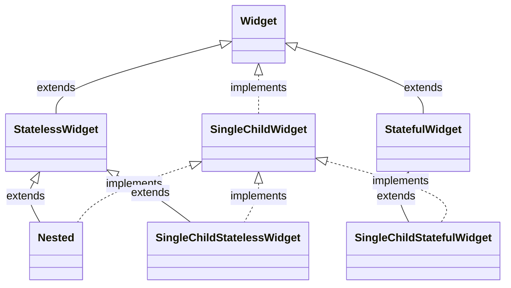

# Flutter Frameworks

## fish-redux

官方文档：[fish-redux/doc at master · alibaba/fish-redux](https://github.com/alibaba/fish-redux/tree/master/doc)

先了解一下 Redux 的理念：中心化的状态管理。Centralizing your application's state and logic enables powerful capabilities like undo/redo, state persistence, and much more.

fish-redux 在 Redux 的基础上发展：The framework not only solves the problem of state management, but also solves the problems of divide and conquer, communication, data drive, decoupling and so on.

Component 是基本单元，是视图呈现和逻辑功能的封装。Page 继承 Component。


分治：单个 Component 内部，用户在 View 触发了 Action（例如点击按钮），造成 Side Effect，通过 Reducer 改变了状态。


集中：全局状态改变如何影响每个具体的 Component

目录结构：

```dart
sample_page
    -- action.dart /// define action types and action creator
    -- page.dart /// config a page or component
    -- view.dart /// define a function which expresses the presentation of user interface
    -- effect.dart /// define a function which handles the side-effect
    -- reducer.dart /// define a function which handles state-change
    -- state.dart /// define a state and some connector of substate
    components
        sample_component
        -- action.dart // 定义页面有哪些动作
        -- component.dart
        -- view.dart  // 页面 Widget
        -- effect.dart // 事件处理，包括 action 里定义的事件、和生命周期事件
        -- reducer.dart // 改变状态
        -- state.dart // 页面有哪些状态
```

例子：[fish-redux/example at master · alibaba/fish-redux](https://github.com/alibaba/fish-redux/tree/master/example)

Middleware 是处理一些面向切面的东西，例如对每个页面的生命周期落日志这种。

`Dependencies` is a structure that expresses dependencies between components.

`adapter`: used to build a high-performance ListView.

`slots`: subcomponents that the component depends on.

`Dependent`: connector + subcomponent

connector: It expresses a data connection relationship of how to read small data from a big data, and how to synchronize to big data when the small data is modified.

有了这个 connector，在 `view.dart` 里面调用 `viewService.buildComponent('report')` 就可以创建子 component，而不用传参数，状态的传递也是通过这个 connector。

生命周期通过 Action 的形式在 `effect.dart` 里处理。

`effect.dart` 不能修改页面状态，要修改页面状态的话，要通过 `dispatch` 派发 Action 到 `reducer.dart` 里处理。

## Nested

[nested | Flutter Package](https://pub.dev/packages/nested)

`Nested`: A widget that simplify the writing of deeply nested widget trees.



## Provider

Provider 是官方推荐的状态管理。

> [Simple app state management | Flutter](https://docs.flutter.dev/development/data-and-backend/state-mgmt/simple)

不用关心这些：`InheritedWidget`, `InheritedNotifier`, `InheritedModel`，Provider 已经封装好了。

要用 Provider，先了解 3 个概念：`ChangeNotifier`, `ChangeNotifierProvider`, `Consumer`。

If something is a `ChangeNotifier`, you can subscribe to its changes. (It is a form of `Observable`, for those familiar with the term.) `ChangeNotifier` is part of `flutter:foundation`.

`ChangeNotifierProvider` is the widget that provides an instance of a `ChangeNotifier` to its descendants. It comes from the provider package.

When you call `notifyListeners()` in your model, all `Consumer` widgets's `builder` method get called.

```dart
class EditNotifier with ChangeNotifier {
  bool isEditing = false;

  void setEditing(bool isEditing) {
    this.isEditing = isEditing;
    notifyListeners();
  }
}

@override
Widget build(BuildContext context) {
  return Scaffold(
    body: ChangeNotifierProvider(
      create: (ctx) => EditNotifier(),
      child: Consumer<EditNotifier>(
        builder: (BuildContext context, notifier, Widget? child) {
          return Text("isEditing: ${notifier.isEditing}");
        },
      ),
    ),
  );
}
```

如果不想包一层 `Consumer`，也可以直接在我们的 Widget 里监听状态：

```dart
Provider.of<CartModel>(context, listen: true).totalPrice;
// 语法糖
context.watch<CartModel>().totalPrice,
```

如果我们不需要更新 UI，只需要访问共享状态时，则可以用：

```dart
Provider.of<CartModel>(context, listen: false).removeAll();
// 语法糖
context.read<CartModel>().removeAll();
```

`listen: false` 使得当前 Widget 不会因为共享状态的改变而 rebuild。
