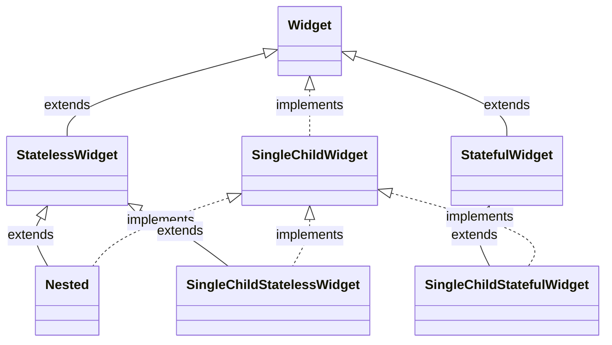

# Flutter Frameworks

## Nested

[nested | Flutter Package](https://pub.dev/packages/nested)

`Nested`: A widget that simplify the writing of deeply nested widget trees.



## Provider

Provider 是官方推荐的状态管理。

> [Simple app state management | Flutter](https://docs.flutter.dev/development/data-and-backend/state-mgmt/simple)

不用关心这些：`InheritedWidget`, `InheritedNotifier`, `InheritedModel`，Provider 已经封装好了。

要用 Provider，先了解 3 个概念：`ChangeNotifier`, `ChangeNotifierProvider`, `Consumer`。

If something is a `ChangeNotifier`, you can subscribe to its changes. (It is a form of "Observable", for those familiar with the term.) `ChangeNotifier` is part of `flutter:foundation`.

`ChangeNotifierProvider` is the widget that provides an instance of a `ChangeNotifier` to its descendants. It comes from the provider package.

When you call `notifyListeners()` in your model, all `Consumer` widgets's `builder` method get called.

```dart
class EditNotifier with ChangeNotifier {
  bool isEditing = false;

  void setEditing(bool isEditing) {
    this.isEditing = isEditing;
    notifyListeners();
  }
}

@override
Widget build(BuildContext context) {
  return Scaffold(
    body: ChangeNotifierProvider(
      create: (ctx) => EditNotifier(),
      child: Consumer<EditNotifier>(
        builder: (BuildContext context, notifier, Widget? child) {
          return Text("isEditing: ${notifier.isEditing}");
        },
      ),
    ),
  );
}
```

如果不想包一层 `Consumer`，也可以直接在我们的 Widget 里监听状态：

```dart
Provider.of<CartModel>(context, listen: true).totalPrice;
// 语法糖
context.watch<CartModel>().totalPrice,
```

如果我们不需要更新 UI，只需要访问共享状态时，则可以用：

```dart
Provider.of<CartModel>(context, listen: false).removeAll();
// 语法糖
context.read<CartModel>().removeAll();
```

`listen: false` 使得当前 Widget 不会因为共享状态的改变而 rebuild。
