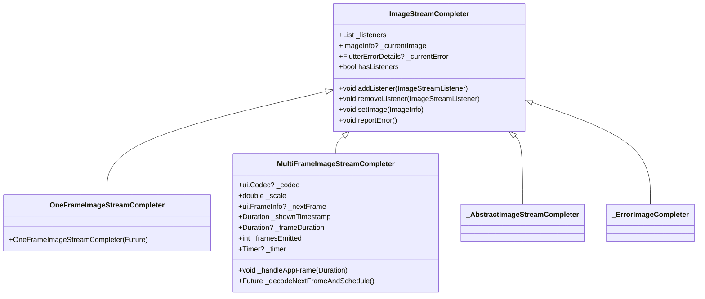

# Flutter Image

## Image

```dart title='flutter/packages/flutter/lib/src/widgets/image.dart'
/// A widget that displays an image.
class Image extends StatefulWidget {}

/// Several constructors are provided:
///  * [Image.new], for obtaining an image from an [ImageProvider].
///  * [Image.asset], for obtaining an image from an [AssetBundle] using a key.
///  * [Image.network], for obtaining an image from a URL.
///  * [Image.file], for obtaining an image from a [File].
///  * [Image.memory], for obtaining an image from a [Uint8List].
```

```dart title='flutter/packages/flutter/lib/src/painting/image_stream.dart'
/// A handle to an image resource.
class ImageStream with Diagnosticable {}

/// A [dart:ui.Image] object with its corresponding scale.
class ImageInfo {}

/// Interface for receiving notifications about the loading of an image.
class ImageStreamListener {}
```

```dart title='flutter/packages/flutter/lib/src/painting/image_provider.dart'
/// Identifies an image without committing to the precise final asset.
abstract class ImageProvider<T extends Object> {}
```

```dart title='flutter/packages/flutter/lib/src/widgets/basic.dart'
/// A widget that displays a [dart:ui.Image] directly.
class RawImage extends LeafRenderObjectWidget {}
```

```dart title='flutter/bin/cache/pkg/sky_engine/lib/ui/painting'
/// lib/ui/painting.dart
/// dart:ui.Image
/// Opaque handle to raw decoded image data (pixels).
class Image {}
```

A bare-bones version of the [widgets.Image] widget:

```dart
class Image extends StatefulWidget {
  const Image({
    super.key,
    required this.imageProvider,
  });

  final ImageProvider imageProvider;

  @override
  State<Image> createState() => _ImageState();
}

class _ImageState extends State<Image> {
  ImageStream? _imageStream;
  ImageInfo? _imageInfo;

  @override
  Widget build(BuildContext context) {
    return RawImage(
      image: _imageInfo?.image, // this is a dart:ui Image object
      scale: _imageInfo?.scale ?? 1.0,
    );
  }

  @override
  void dispose() {
    _imageStream?.removeListener(ImageStreamListener(_updateImage));
    _imageInfo?.dispose();
    _imageInfo = null;
    super.dispose();
  }

  void _resolveImage() {
    final ImageStream? oldImageStream = _imageStream;
    _imageStream = widget.imageProvider.resolve(createLocalImageConfiguration(context));
    if (_imageStream!.key != oldImageStream?.key) {
      // If the keys are the same, then we got the same image back, and so we don't
      // need to update the listeners. If the key changed, though, we must make sure
      // to switch our listeners to the new image stream.
      final ImageStreamListener listener = ImageStreamListener(_updateImage);
      oldImageStream?.removeListener(listener);
      _imageStream!.addListener(listener);
    }
  }

  void _updateImage(ImageInfo imageInfo, bool synchronousCall) {
    setState(() {
      // Trigger a build whenever the image changes.
      _imageInfo?.dispose();
      _imageInfo = imageInfo;
    });
  }
}
```

如果用通俗的语言来描述他们的关系，可以这么理解：

- Image（消费者）：想要展示一张图片。
- ImageProvider（生产者）：负责提供图片数据，从不同的来源获取图片（如网络、文件、内存等）。
- ImageStream（传送带）：负责传递图片数据。
- ImageStreamCompleter: 管理图像加载和解码的过程
- ImageStreamListener（监听者）：监听图片传送过程中的变化（如图片加载完成、加载进度、错误等）并做出相应处理。

Widget 需要显示图片时，调用 `provider.resolve` 得到 ImageStream，通过它来接收图片数据并交给 `listener` 处理。如果是动图，会持续传送新的图片帧。

`_ImageState`里采用的是单一的监听者，它负责接收和处理图片加载的各个阶段（如图片加载完成、加载错误等）。

TODO: 即使某些场景只需要单一监听者，但 `ImageStream` 预留多监听者的能力可以支持更复杂的使用场景。

TODO: 两个 Widget 显示同一张图片会怎么样？

## ImageProvider

The `ImageProvider` goes through the following lifecycle to resolve an image, once the `resolve` method is called:

1. Create an `ImageStream` using `createStream` to return to the caller. This stream will be used to communicate back to the caller when the image is decoded and ready to display, or when an error occurs.
2. Obtain the key for the image using `obtainKey`.
3. If the key is successfully obtained, schedule resolution of the image using that key. This is handled by `resolveStreamForKey`. That method may set the completer from the cache if possible, or call `loadImage` to fetch the encoded image bytes and schedule decoding.
4. The `loadImage` method is responsible for both fetching the encoded bytes and decoding them using the provided `ImageDecoderCallback`.

```dart
ImageStream resolve(ImageConfiguration configuration) {
    final ImageStream stream = ImageStream();
    // Load the key (potentially asynchronously), set up an error handling zone,
    // and call resolveStreamForKey.
    _createErrorHandlerAndKey(
        configuration,
        (T key, ImageErrorListener errorHandler) {
            resolveStreamForKey(configuration, stream, key, errorHandler);
        },
    );
    return stream;
}

void _createErrorHandlerAndKey(ImageConfiguration configuration) {
    /// Converts an [ImageProvider]'s settings plus an [ImageConfiguration] to a key
    /// that describes the precise image to load.
    obtainKey(configuration).then<void>((T key) {
      successCallback(key, handleError);
    });
}

void resolveStreamForKey(ImageConfiguration configuration, ImageStream stream, T key, ImageErrorListener handleError) {
    /// Returns the previously cached [ImageStream] for the given key, if available;
    /// if not, calls the given callback to obtain it first. In either case, the
    /// key is moved to the 'most recently used' position.
    final ImageStreamCompleter? completer = PaintingBinding.instance.imageCache.putIfAbsent(
      key,
      () {
        // loadImage是ImageProvider的子类（例如`NetworkImagd`）需要实现的方法
        // loadImage方法做两件事情：1. 根据key获取编码的图片字节；2. 使用ImageDecoderCallback解码
        ImageStreamCompleter result = loadImage(key, PaintingBinding.instance.instantiateImageCodecWithSize);
        return result;
      },
      onError: handleError,
    );
    if (completer != null) {
      stream.setCompleter(completer);
    }
}
```



## NetworkImage

```dart title='flutter/packages/flutter/lib/src/painting/_network_image_io.dart'
@override
ImageStreamCompleter loadImage(NetworkImage key, ImageDecoderCallback decode) {
    final StreamController<ImageChunkEvent> chunkEvents = StreamController<ImageChunkEvent>();
    return MultiFrameImageStreamCompleter(
        /// The `codec` parameter is a future for an initialized [ui.Codec] that will
        /// be used to decode the image.
        codec: _loadAsync(key as NetworkImage, chunkEvents, decode: decode),
        /// The `chunkEvents` parameter is an optional stream of notifications about
        /// the loading progress of the image.
        chunkEvents: chunkEvents.stream,
        scale: key.scale,
    );
}

Future<ui.Codec> _loadAsync(
    NetworkImage key,
    StreamController<ImageChunkEvent> chunkEvents, {
    required _SimpleDecoderCallback decode,
  }) async {
    final Uri resolved = Uri.base.resolve(key.url);

    final HttpClientRequest request = await _httpClient.getUrl(resolved);

    final HttpClientResponse response = await request.close();
    // print(response.statusCode);

    final Uint8List bytes = await consolidateHttpClientResponseBytes(
        response,
        onBytesReceived: (int cumulative, int? total) {
            chunkEvents.add(ImageChunkEvent(
                cumulativeBytesLoaded: cumulative,
                expectedTotalBytes: total,
            ));
        },
    );
    return decode(await ui.ImmutableBuffer.fromUint8List(bytes));
}
```

Codec（编解码器）是 "Coder/Decoder" 的缩写。

```dart title='flutter/packages/flutter/lib/src/painting/image_stream.dart'
MultiFrameImageStreamCompleter({
    required Future<ui.Codec> codec,
    required double scale,
    String? debugLabel,
    Stream<ImageChunkEvent>? chunkEvents,
    InformationCollector? informationCollector,
  }) : _informationCollector = informationCollector,
       _scale = scale {
  codec.then<void>(_handleCodecReady);
}

void _handleCodecReady(ui.Codec codec) {
  _codec = codec;
  if (hasListeners) {
    _decodeNextFrameAndSchedule();
  }
}

Future<void> _decodeNextFrameAndSchedule() async {
  _nextFrame?.image.dispose();
  _nextFrame = null;
  _nextFrame = await _codec!.getNextFrame();
  
  if (_codec!.frameCount == 1) {
    if (!hasListeners) {
      return;
    }
    _emitFrame(ImageInfo(
      image: _nextFrame!.image.clone(),
      scale: _scale,
    ));
    _nextFrame!.image.dispose();
    _nextFrame = null;
    return;
  }
  _scheduleAppFrame();
}

void _scheduleAppFrame() {
  SchedulerBinding.instance.scheduleFrameCallback(_handleAppFrame);
}
```

## cached_network_image
