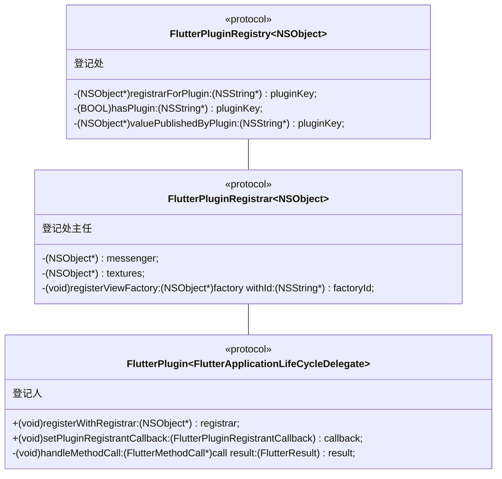

# Flutter Primer

## 安装

[macOS install](https://flutter.dev/docs/get-started/install/macos)

下载安装 Flutter，然后，将这个文件夹加到 $PATH 中：

```bash
export PATH="$HOME/Documents/flutter/bin:$PATH"
```

然后，运行 `flutter doctor`，flutter 会下载一系列相关的 SDK。

下载完成后，`~/.pub-cache/hosted/pub.dartlang.org` 文件夹下会多了很多 pub packages，我们开发的 flutter 工程所安装的 pub，都会在这个目录下缓存。

此外，如果有自定义的 pub package 源，也会出现在 `~/.pub-cache/hosted/` 下面，以域名命名的文件夹。

同时，新增了 `flutter/bin/cache`，TODO: 这些缓存的作用。

## 新建项目

在命令行直接创建新项目，默认原生语言是 kotlin 和 swift，使用 objc 和 java 需要传参。

这里我们创建一个 flutter 项目，它主要实现的功能是获取原生端电池的电量，项目名称只能小写（有大写字母会报错）：

```bash
flutter create -i objc -a java battery_level
```

## 常用命令

p: debug painting, see the wireframe for each widget

或者：

```dart
import 'package:flutter/rendering.dart';

void main() {
  debugPaintSizeEnabled = true;
  runApp(MyApp());
}
```

或者 Flutter inspector - Debugging layout issues visually

r: hot reload

R: restart

对于 iOS 开发者，改动了原生代码，可以先在 Xcode 把 flutter 运行起来，然后在命令行通过 `flutter attach` 连接调试。

`flutter devices` 查看可连接的设备

`flutter attach -d 37399F6A-35C4-4ED8-B460-D6E0C043EBAF` 指定设备连接

## AS 快捷键

定位到当前文件：Select Opened File 或者选择 Always Select Opened File

文件导航后退前进：Command + Option + Left/Right

Reformat code: Command + Option + L

## Platform Channel

如何从 dart 代码调用到 native？[Writing custom platform-specific code](https://flutter.dev/docs/development/platform-integration/platform-channels)

第一步，dart 代码声明一个 channel：`static const platform = MethodChannel('samples.flutter.dev/battery');`

第二步，dart 调用 `await platform.invokeMethod('getBatteryLevel');`

```dart title='my_homepage.dart'
class _MyHomePageState extends State<MyHomePage> {
  String _batteryLevel = '';

  static const platform = MethodChannel('samples.flutter.dev/battery');

  Future<void> _getBatteryLevel() async {
    String batteryLevel;
    try {
      final int result = await platform.invokeMethod('getBatteryLevel');
      batteryLevel = 'Battery level at $result % .';
    } on PlatformException catch (e) {
      batteryLevel = "Failed to get battery level: '${e.message}'.";
    }
    setState(() {
      _batteryLevel = batteryLevel;
    });
  }
}
```

第三步，原生实现

```objc title='MyFlutterViewController.m'
- (void)viewDidLoad {
    [super viewDidLoad];

    FlutterMethodChannel *batteryChannel = [FlutterMethodChannel methodChannelWithName:@"samples.flutter.dev/battery" binaryMessenger:self.binaryMessenger];
    __weak typeof(self) weakSelf = self;
    [batteryChannel setMethodCallHandler:^(FlutterMethodCall *call, FlutterResult result) {
        // Note: this method is invoked on the UI thread.
        __strong typeof(weakSelf) strongSelf = weakSelf;
        if (![strongSelf canHandleMethod:call.method]) {
            result(FlutterMethodNotImplemented); // 记得给flutter回调，不然await后面的不会执行了
            return;
        }
        int batteryLevel = [weakSelf getBatteryLevel];
        if (batteryLevel == -1) {
            result([FlutterError errorWithCode:@"UNAVAILABLE"
                                       message:@"Battery info unavailable"
                                       details:nil]);
        } else {
            result(@(batteryLevel));
        }
    }];
}
```

`binaryMessenger` 是 `FlutterViewController` 的属性，实际取的是引擎的 binary messenger：

```objc
/**
 * The `FlutterBinaryMessenger` associated with this FlutterViewController (used for communicating
 * with channels).
 *
 * This is just a convenient way to get the |FlutterEngine|'s binary messenger.
 */
@property(nonatomic, readonly) NSObject<FlutterBinaryMessenger>* binaryMessenger;
```

### 机制

Messages are passed between the **client** (UI, 也就是 dart 代码那一层) and **host** (platform, 也就是原生代码那一层) using platform channels.

The client sends messages to its host. The host listens on the platform channel, and receives the message.

Messages and responses are passed asynchronously, to ensure the user interface remains responsive.

You must invoke a channel method on the platform’s main thread.

If desired, method calls can also be sent in the reverse direction, with the platform acting as client to methods implemented in Dart. 原生端也可以调用 dart 层代码。

原生调用 dart，要在主线程：When invoking channels on the platform side destined for Flutter, they need to be invoked on the platform’s main thread.

dart 调用原生，要在 root Isolate：When invoking channels in Flutter destined for the platform side, they need to be invoked on the root Isolate.

### 数据类型

Dart 数据类型对应平台的数据类型：

<https://docs.flutter.dev/development/platform-integration/platform-channels?tab=type-mappings-obj-c-tab#codec>

## Dart packages and Plugin packages

[Developing packages & plugins](https://flutter.dev/docs/development/packages-and-plugins/developing-packages)

packages 可以是纯 dart 代码，也可以包含对原生的调用，调用了原生的话 flutter 称之为 plugin。

如何区分一个 package 是 dart 还是 plugin？看它目录下的 `pubspec.yml` 文件，如果是 plugin 的话会有 `plugin` 字段：

```yml
flutter:
  # This section identifies this Flutter project as a plugin project.
  plugin:
    platforms:
      android:
        package: com.yianzhou.hello
        pluginClass: HelloPlugin
      ios:
        pluginClass: HelloPlugin
```

### Dart packages

例如，以（业务的）页面开发为单位，每个页面一个 package，页面之间完全隔离。

新建 dart packages：`flutter create --template=package welcome`

在主工程的 `pubspec.yml` 的 `dependencies` 引用这个 package:

```yml
dependencies:
  welcome:
    path: "welcome/"
```

然后在 dart 代码中引入这个 package 就可以调用。

### Plugin packages

所谓 plugin，不过是有原生代码的 package 而已，也是通过前面所讲的 FlutterMethodChannel 来实现 dart 对原生的调用，没什么特别的。

新建 plugin packages：

```bash
flutter create --org com.yianzhou --template=plugin --platforms=android,ios -i objc -a java hello
```

新建好 plugin packages 后，里面有 examples/ 文件夹，首先要做的是在 Xcode 中把 example 跑起来。

开发 plugin：

- dart 代码位于 `hello/lib/hello.dart`
- iOS 代码位于 `hello/ios/Classes/HelloPlugin.m`

将 plugin 引入主工程——在主工程的 `pubspec.yml` 文件，加入 plugin 的声明：

```yml
dependencies:
  hello:
    path: "hello/"
```

运行 `flutter pub get` 之后，会自动生成 `ios/Runner/GeneratedPluginRegistrant.m` 文件，所有的 plugin 会在这个自动生成的类里注册：

```objc title='GeneratedPluginRegistrant.m'
+ (void)registerWithRegistry:(NSObject<FlutterPluginRegistry>*)registry {
  [HelloPlugin registerWithRegistrar:[registry registrarForPlugin:@"HelloPlugin"]];
}
```

如果在 `pubspec.yml` 文件里没有声明任何 plugin，那 `registerWithRegistry:` 会是空实现。

`HelloPlugin` 这个名字就是在 `hello/pubspec.yml` 里面声明的 `pluginClass`。

注意 `AppDelegate.m`，当我们新建一个 flutter 工程时，会自动生成以下的代码：

```objc title='AppDelegate.m'
- (BOOL)application:(UIApplication *)application didFinishLaunchingWithOptions:(NSDictionary *)launchOptions {
  [GeneratedPluginRegistrant registerWithRegistry:self]; // 在这里注册所有的 plugin
  return [super application:application didFinishLaunchingWithOptions:launchOptions];
}
```

如果需要依赖其它第三方 pod，则加在 `hello/ios/hello.podspec` 里面：

```rb
s.dependency 'SDWebImage'
```

## Package 的安装位置

以 [local_auth](https://pub.dev/packages/local_auth) 为例，在主工程 `pubspec.yaml` 添加依赖后，运行 `flutter pub get`，然后打开 ios 原生工程执行 `pod install`，local_auth 的原生代码部分是通过 Development Pods 的方式集成到工程里，并通过 symlinks 的方式，软链接到以下位置：

`~/.pub-cache/hosted/pub.dartlang.org/local_auth-1.1.10/ios/Classes/`

## 使用 Package

安装慢的解决方法：官方教程有指导 [Using Flutter in China](https://flutter.dev/community/china)

在 shell 中输入以下命令，再运行 `flutter pub get`

```
export PUB_HOSTED_URL=https://pub.flutter-io.cn
export FLUTTER_STORAGE_BASE_URL=https://storage.flutter-io.cn
```

如何指定版本 You can express version constraints using either caret syntax (^1.2.3) or traditional syntax ('>=1.2.3 <2.0.0').

```yaml
dependencies:
  ## version range with caret syntax, any 5.4.x version where x >= 0 works.
  url_launcher: ^5.4.0

  ## version range with traditional syntax
  url_launcher: '>=5.4.0 <6.0.0'

  ## 指定到文件系统的路径，这个路径下有 pubspec.yaml 文件
  plugin1:
    path: ../plugin1/

  ## 指定到 git 仓库
  plugin2:
    git:
      url: git://github.com/flutter/plugin1.git ## the Git URL that can be used to clone the package.
      path: packages/some_package ## git 仓库下的路径
      ref: some-branch ## depend on a specific commit, branch, tag, or anything that Git allows to identify a commit.

  ## 自己指定一个源（不指定的话，默认使用 pub.dev 源）
  transmogrify:
    hosted:
      name: transmogrify
      url: http://some-package-server.com
    version: ^1.0.0
```

`.lock` 文件的作用：When running `flutter pub get` for the first time after adding a package, Flutter saves the concrete package version found in the `pubspec.lock` lockfile. This ensures that you get the same version again if you, or another developer on your team, run flutter pub get.

If it’s only imported from test, example, etc. it can and should be a dev dependency.

```yaml
dev_dependencies:
  plugin1: ">=0.5.0 <0.12.0"
```

版本冲突：如果两个 package 同时依赖了 url_launcher，而他们指定的版本又不一样的话，就会发生版本冲突。可以通过 dependency override 解决。

## Add-to-app

[Add Flutter to existing app | Flutter](https://docs.flutter.dev/development/add-to-app)

Add-to-app supports adding multiple instances of Flutter engines, screens, or views into your app.

### Project setup

在原生工程的**父级目录**下运行命令：`flutter create --template module my_flutter`，形成 iOS、Android、Flutter module 同级的目录结构。

创建好后，`my_flutter/` 这个文件夹和一般的 flutter 工程无异，可以单独 `flutter run` 或 `flutter build ios`。

`.ios/` 这个隐藏的文件夹是自动生成的，不要修改里面的东西，也不要把它加到版本控制里。

用 CocoaPods 集成要求团队所有成员的电脑里都有 Flutter SDK。

首先，在原生工程的 Podfile 中添加：

```rb
flutter_application_path = 'my_flutter'
load File.join(flutter_application_path, '.ios', 'Flutter', 'podhelper.rb')

target 'MyApp' do
  install_all_flutter_pods(flutter_application_path)
end
```

`File.join` 就是把入参的几个字符串用 "/" 拼成文件路径；`load` 就是加载并执行这个文件的代码。

所以这里的意思就是载入 `my_flutter/.ios/Flutter/podhelper.rb` 这个文件。`install_all_flutter_pods` 是 `podhelper.rb` 这个文件里定义的函数。

注意，每次修改 `my_flutter/pubspec.yaml` 文件后，run `flutter pub get` to refresh the list of plugins read by the `podhelper.rb` script. Then, run `pod install` again.

The `podhelper.rb` script embeds your plugins, `Flutter.framework`, and `App.framework` into your project.

`Flutter.framework` is the bundle for the Flutter engine, and `App.framework` is the compiled Dart code for this project.

### Adding a Flutter screen to an iOS app

[Adding a Flutter screen to an iOS app | Flutter](https://docs.flutter.dev/development/add-to-app/ios/add-flutter-screen)

1. 把 flutter 引擎加进来，并运行起来（通常是在 `AppDelegate`）
2. 展示一个 `FlutterViewController`

The `FlutterEngine` serves as a host to the Dart VM and your Flutter runtime, and the `FlutterViewController` attaches to a `FlutterEngine` to pass UIKit input events into Flutter and to display frames rendered by the `FlutterEngine`.

It’s generally recommended to pre-warm a long-lived `FlutterEngine` for your application because:

- The first frame appears faster when showing the `FlutterViewController`.
- Your Flutter and Dart state will outlive one `FlutterViewController`.
- Your application and your plugins can interact with Flutter and your Dart logic before showing the UI.

If your app delegate can’t directly make `FlutterAppDelegate` a subclass, make your app delegate implement the `FlutterAppLifeCycleProvider` protocol in order to make sure your plugins receive the necessary callbacks.

在这个例子中，flutter 的 `main()` 会在我们调用 `[self.flutterEngine run]` 时执行。

Calling `run` on a `FlutterEngine`, by default, runs the `main()` Dart function of your `lib/main.dart` file. You can also run a different entrypoint function by using `runWithEntrypoint` with an `NSString` specifying a different Dart function.

`flutterEngine.run(withEntrypoint: FlutterDefaultDartEntrypoint, initialRoute: "/onboarding")` This code sets your dart:ui’s window.defaultRouteName to "/onboarding" instead of "/".

In order to imperatively change your current Flutter route from the platform side after the FlutterEngine is already running, use `pushRoute()` or `popRoute()` on the FlutterViewController.

To pop the iOS route from the Flutter side, call `SystemNavigator.pop()`.

## Flutter Tools

我们在命令行使用的 `flutter` 指令，位于 `flutter/bin` 路径下。查看其源码，发现其执行的是 `flutter/bin/internal/shared.sh`，其中最关键的执行代码：

```bash
"$DART" --disable-dart-dev --packages="$FLUTTER_TOOLS_DIR/.packages" $FLUTTER_TOOL_ARGS "$SNAPSHOT_PATH" "$@"
```

`$DART` 是 `flutter/bin/cache/dart-sdk/bin/dart`；

`$SNAPSHOT_PATH` 是 `flutter/bin/cache/flutter_tools.snapshot`，这是 `flutter/packages/flutter_tools` 项目编译的产物。

将 `"$SNAPSHOT_PATH"` 改为 `"$FLUTTER_ROOT/packages/flutter_tools/bin/flutter_tools.dart"`，再运行 `flutter` 命令就会执行本地 flutter_tools 项目的代码。

## Plugin




## 全家桶

- <https://github.com/flutter/flutter>
- <https://github.com/flutter/engine>
- <https://github.com/dart-lang/sdk>
- <https://github.com/google/skia>

dSYM: <https://storage.cloud.google.com/flutter_infra_release/flutter/6ba2af10bb05c88a2731482cedf2cfd11cf5af0b/ios-release/Flutter.dSYM.zip>

`flutter/bin/internal/engine.version` 查看 hash，把上面链接的 hash 替换成当前 flutter 版本的 hash。

或者打开 `Flutter.framework` 的 `Info.plist`，也可以看到 engine 版本。

`engine/DEPS` 这个文件记录了引擎用的 dart 版本、skia 版本等信息。

## Navigator

对于非常重的页面（例如有视频、图片等资源），在多次 Push 之后可能会出现 OOM 的情况，如何解决？

```dart
import 'package:flutter/material.dart';

void main() {
  runApp(const MyApp());
}

class Page {
  String title;
  double scrollPositionY;
}

class MyApp extends StatelessWidget {
  const MyApp({Key? key}) : super(key: key);

  List<Page> _pages;

  @override
  Widget build(BuildContext context) {
    return MaterialApp(
      title: 'Flutter Demo',
      home: Navigator(
          pages: _optimizeGetPages().map((e) => MaterialPage(child: Text(e.title))).toList(),
          onPopPage: (route, result) {
            _pages.removeLast();
            return route.didPop(result);
          }),
    );
  }

  List<Page> _optimizeGetPages() {
    return _pages.sublist(_pages.length - 3);
  }
}
```
