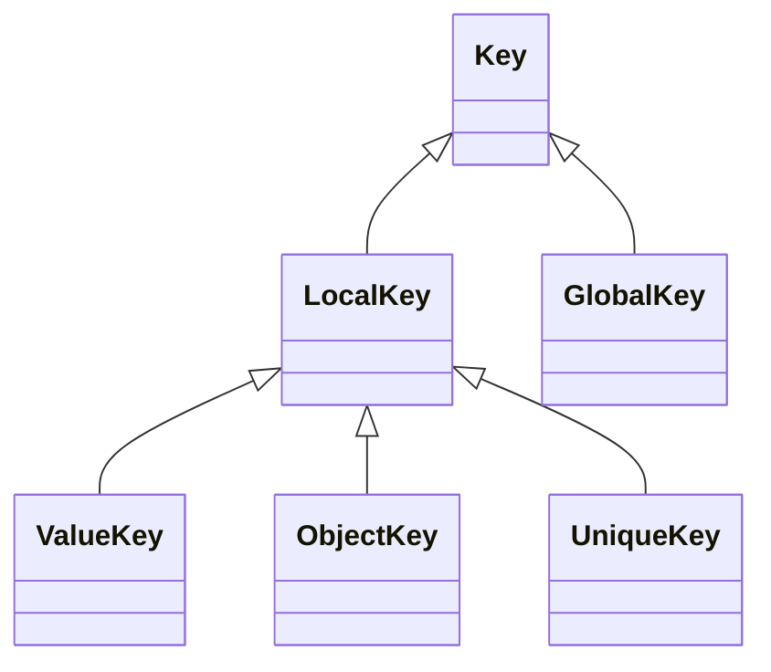
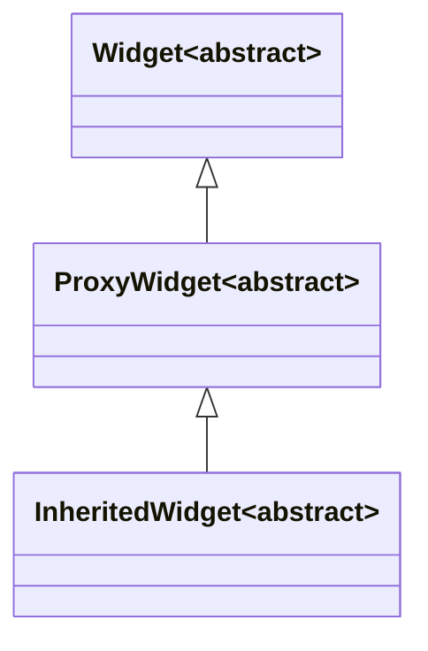
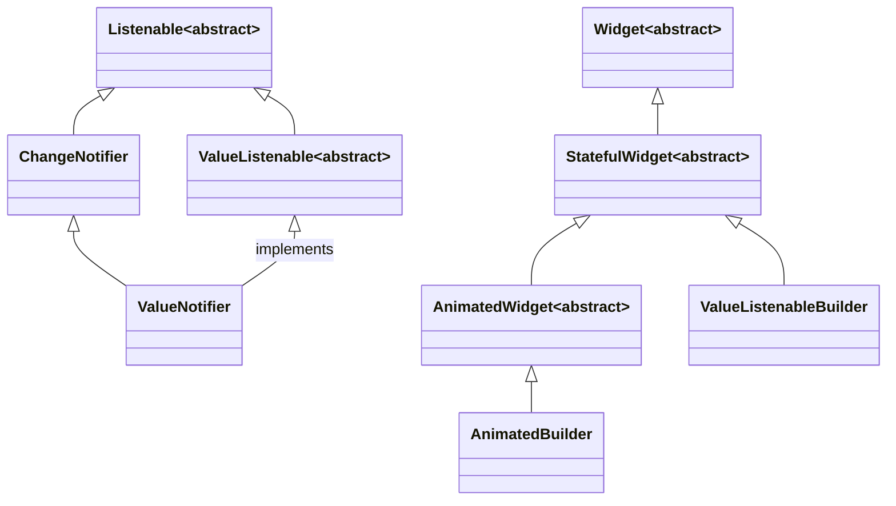
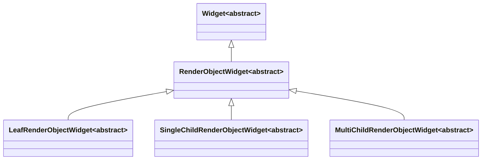

# Flutter Widget

> [Bringing it all together](https://flutter.dev/docs/development/ui/widgets-intro#bringing-it-all-together)
>
> [Flutter Widget of the Week](https://www.youtube.com/playlist?list=PLjxrf2q8roU23XGwz3Km7sQZFTdB996iG)
>
> [Flutter Widget 101](https://www.youtube.com/playlist?list=PLOU2XLYxmsIJyiwUPCou_OVTpRIn_8UMd)

## Widget 原理

In Flutter, almost everything is a widget.

Widgets are immutable and only exist until they need to be changed. 一旦创建就是不可变的，state 改变会导致销毁并重建。

Flutter’s widgets are lightweight, in part due to their immutability. Because they aren’t views themselves, and aren’t directly drawing anything, but rather are a **description** of the UI and its semantics that get “inflated” into actual view objects under the hood.

Implementing a stateful widget requires at least two classes: 1) a `StatefulWidget` class that creates an instance of 2) a `State` class. You might wonder why StatefulWidget and State are separate objects. In Flutter, these two types of objects have different life cycles. Widgets are temporary objects, used to construct a presentation of the application in its current state. State objects, on the other hand, are persistent between calls to `build()`, allowing them to remember information.

Calling `setState` marks this widget as dirty and schedules it to be rebuilt the next time your app needs to update the screen. By managing state in this way, you don’t need to write separate code for creating and updating child widgets. Instead, you simply implement the build function, which handles both situations.

## StatelessWidget

```dart
import 'package:flutter/material.dart';

// 给卡片视图加上阴影
class CardShadowContainer extends StatelessWidget {
  const CardShadowContainer({Key key, this.child}) : super(key: key);

  final Widget child;

  @override
  Widget build(BuildContext context) {
    return Container(
      child: child,
      decoration: const BoxDecoration(
        borderRadius: BorderRadius.all(
          Radius.circular(4.0),
        ),
        boxShadow: [
          BoxShadow(
            color: Color.fromRGBO(0, 0, 0, 0.02), // 阴影颜色
            offset: Offset(0.0, 2.0), // 阴影y轴偏移量
            blurRadius: 4, // 阴影模糊程度
            spreadRadius: 0, // 阴影扩散程度
          )
        ],
      ),
    );
  }
}
```

## Widget 简介

`MaterialApp` 作为根 Widget。

`Scaffold` 是 Material Design 布局结构的基本实现，属性有 `appBar`, `floatingActionButton`, `drawer` 等。

当键盘弹出时，如果您不想让页面上的组件随之移动，可以在 `Scaffold` 的 `resizeToAvoidBottomInset` 属性设置为 `false`。这将阻止 `Scaffold` 为键盘调整大小，从而使界面中的其他部分保持不变。

```dart
Scaffold(
  // 让底部蓝色按钮不跟着移动
  resizeToAvoidBottomInset: false,
  body: Column(
    children: [
      buildCommonStatusBar(context),
      _buildNavbar(context),
      Expanded(
        child: ListView(),
      ),
      // 让键盘弹出时，能够自适应高度
      SizedBox(height: MediaQuery.of(context).viewInsets.bottom),
      bottomWidget, // 底部蓝色按钮
      SizedBox(height: MediaQuery.of(context).padding.bottom),
    ],
  ),
);
```

`Center` 会将它的 child 居中显示。

`Container` 可设置宽高、圆角、margin、padding 的容器。属性有 `alignment`。

`ListView` 线性排列它的 children 的可滑动组件。

- `ListTile`: A single fixed-height row that typically contains some text as well as a leading or trailing icon.

`GridView`: A scrollable, 2D array of widgets.

`Padding`: Fluttter 中很多 Widget 没有 padding 属性，可以用 `Padding`组件来实现内间距。

`Row`, `Column`: 水平、垂直布局组件，几乎是最常用的组件。属性有 `mainAxisAlignment`, `crossAxisAlignment`。

- `Expanded` 可以用在 `Row`, `Column`，属性有 `flex`。例：`Row` 里固定宽度 + 自适应的组合。
- `Flexible`: Flexible takes only the needed space, and Expanded takes all available space.
- `SizedBox` 可以用在 `Row`, `Column`，用于占位固定的宽/高。
- `Spacer` 可以用在 `Row`, `Column` 布局时加入可自适应的间隔。

`Row` 里面的 `Text` 超过一行怎么办？用 `Flexible` 包住 `Text`

`Stack` 将 children 都堆叠在一起。

- `Align`：依附在 `Stack` 的某个方位。
- `Positioned`：灵活控制在 `Stack` 中的位置。

## Widget 简介 2

[`InkWell`](https://api.flutter.dev/flutter/material/InkWell-class.html): A rectangular area of a Material that responds to touch.

实现透明度：In Flutter, most of the time you need to wrap a widget in an `Opacity` widget to accomplish this.

`AspectRatio` 可以设置 child 的宽高比。

`Card` 卡片效果。

`Wrap`：`Row`, `Column` 是单行单列的，但 `Wrap` 可以突破这个限制，主轴空间不足时则向交叉轴扩展显示（即可以换行）。

`FittedBox`: 类似 `UIView` 的 `contentMode`

`InheritedWidget`: Base class for widgets that efficiently propagate information down the tree. 例如：在控件树的叶子节点取根节点的信息。

[`Hero`](https://api.flutter.dev/flutter/widgets/Hero-class.html): A widget that marks its child as being a candidate for [hero animations](https://flutter.dev/docs/development/ui/animations/hero-animations).

## 按钮


`RaisedButton` 已经弃用，请使用 `ElevatedButton`。

`FlatButton`：扁平的按钮，已经弃用，请使用 `TextButton`。

`OutlineButton`：线框按钮，已经弃用，请使用 `OutlinedButton`。

`IconButton`：图标按钮

`ButtonBar`：按钮组

`FloatingActionButton`：浮动按钮

## 生命周期


`State<StatefulWidget> createState ()` return state for this widget.

`bool mounted` Whether this State object is currently in a tree. After createState and before calling initState, the framework "mounts" the State object by associating it with a BuildContext.

`void initState ()` Called when this object is inserted into the tree. Subscribe to the object，for example a ChangeNotifier or Stream in this callback.

`void didChangeDependencies ()` This method is also called immediately after `initState`. 它会在“依赖”发生变化时被 Flutter 框架调用。而这个“依赖”指的就是子 widget 是否使用了父 widget 中 `InheritedWidget` 的数据！比如当 `InheritedWidget` 的主题、颜色等发生变化时，子 widget 的 `didChangeDependencies` 方法将会被调用。

`Widget build (BuildContext context)` This method can potentially be called in every frame and should not have any side effects beyond building a widget.

`void didUpdateWidget (covariant T oldWidget)` If the parent widget rebuilds and request that this location in the tree update to display a new widget with the same runtimeType and Widget.key, the framework will update the widget property of this State object to refer to the new widget and then call this method with the previous widget as an argument.

`void setState (VoidCallback fn)` Notify the framework that the internal state of this object has changed.

`void deactivate ()` Called when this object is removed from the tree.

`void dispose ()` Called when this object is removed from the tree permanently.

## Widget 与 Element

> [Flutter 教程 Key-2 Widget 和 Element 的对应关系](https://www.bilibili.com/video/BV15k4y1B74z)

Widget 是不可变的，一旦被建立出来，就不可以在运行时改变。能够改变的是状态。

`setState` 会触发 `Widget` 的 `build` 方法，重建一个新的 `Widget`，旧的会被抛弃掉，而不是在旧的基础上做修改。

新的 `Widget` 不断构建、旧的 `Widget` 不断废弃，能够在这个过程中被始终保存下来的，是状态。这就是为什么 `StatefulWidget` 要创建一个 `State` 对象。


## Widget Key

Widget 重建时比较两个东西 1. Widget 的类型；2. Key。

```dart title='packages/flutter/lib/src/widgets/framework.dart'
static bool canUpdate(Widget oldWidget, Widget newWidget) {
  return oldWidget.runtimeType == newWidget.runtimeType
      && oldWidget.key == newWidget.key;
}
```

`Key` 有两个子类，`LocalKey` 针对同一级 Widget，`GlobalKey` 针对全局；尽量用 `LocalKey` 因为会快很多。



`GlobalKey` 主要有两种用法，一是让 Widget 在 Widget Tree 发生大幅改动的时候仍然保留状态；二是像 JavaScript 里面 `getElementById` 那样查找某个元素并得到它的各种信息。

## FutureBuilder

> [Flutter 教程 Async-3 深入详解 FutureBuilder 组件](https://www.bilibili.com/video/BV165411V7PS/?spm_id_from=pageDriver)

```dart
FutureBuilder getSimpleFutureBuilder() {
  return FutureBuilder(
    future: getDelayedAlice(),
    builder: (BuildContext context, AsyncSnapshot<dynamic> snapshot) {
      print(snapshot.connectionState); // future 目前的状态
      print(snapshot.data); // future 的数据（已完成的情况下）
      print(snapshot.error); // future 的错误（异常的情况下）
      return Container();
    },
  );
}
```

`FutureBuilder` 主要用于跟踪 `Future` 的变化并自动重绘。每次重绘时，`AsyncSnapshot` 会描述 `Future` 的最新动态。

## InheritedWidget



`Widget`: Describes the configuration for an `Element`.

`ProxyWidget`: A widget that has a child widget provided to it, instead of building a new widget.

`InheritedWidget`: Base class for widgets that efficiently propagate information down the tree.

## ChangeNotifier



`AnimatedBuilder`: Despite the name, `AnimatedBuilder` is not limited to `Animation`s. Any subtype of `Listenable` (such as `ChangeNotifier` and `ValueNotifier`) can be used with an `AnimatedBuilder` to rebuild only certain parts of a widget when the `Listenable` notifies its listeners. This technique is a performance improvement that allows rebuilding only specific widgets leaving others untouched.

## RenderObjectWidget



`LeafRenderObjectWidget`: 用于没有子节点的 widget，通常基础组件都属于这一类，如 Image。

## Navigator

```dart
bool isTopMostRoute() {
  String? top;
  // the top most route name could be found through this tricky method
  // which is trying to pop the top most route but prevented by the return value true
  Navigator.popUntil(context, (route) {
    top = route.settings.name;
    return true;
  });
  return top == "qb://flutter/file/reader/fileClassify";
}
```
