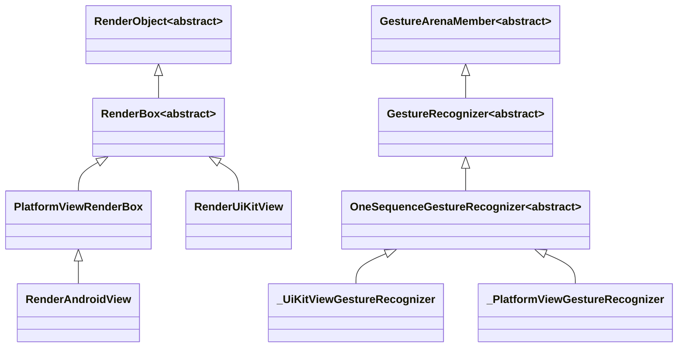
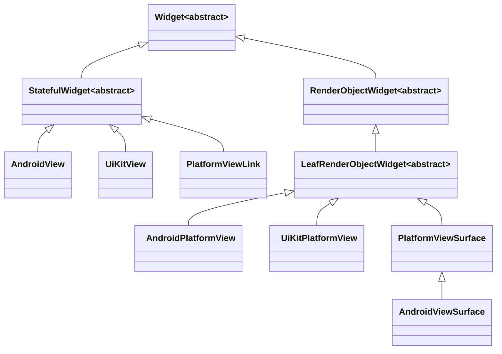
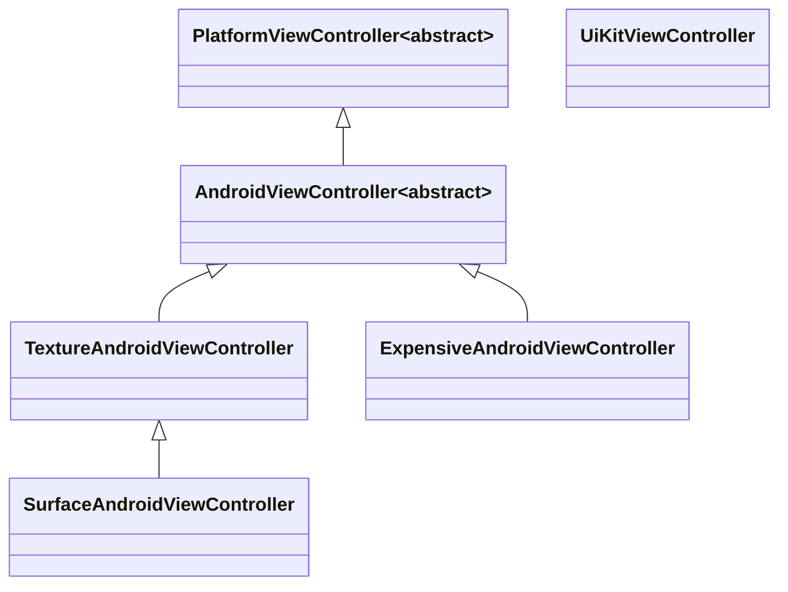

# PlatformView

## Rendering



## Widget



## Service



## iOS

```dart
class UiKitView extends StatefulWidget {
  @override
  State<UiKitView> createState() => _UiKitViewState();
}

class _UiKitViewState extends State<UiKitView> {
  UiKitViewController? _controller;

  @override
  Widget build(BuildContext context) {
    return _UiKitPlatformView(
      controller: _controller!,
      hitTestBehavior: widget.hitTestBehavior,
      gestureRecognizers: widget.gestureRecognizers ?? _emptyRecognizersSet,
    );
  }

  Future<void> _createNewUiKitView() async {
    // 通过 channel 调用平台层，创建 UIView
    final UiKitViewController controller = await PlatformViewsService.initUiKitView(
      id: id,
      viewType: widget.viewType,
      layoutDirection: _layoutDirection!,
      creationParams: widget.creationParams,
      creationParamsCodec: widget.creationParamsCodec,
    );
    setState(() {
      _controller = controller;
    });
  }
}

class _UiKitPlatformView extends LeafRenderObjectWidget {
  @override
  RenderObject createRenderObject(BuildContext context) {
    return RenderUiKitView(
      viewController: controller,
      hitTestBehavior: hitTestBehavior,
      gestureRecognizers: gestureRecognizers,
    );
  }
}
```

## 线程

当有 `PlatformView` 在屏幕上时，Rasterizer 会转移到 Platform thread 上工作（即平台的主线程）；称为动态线程合并。

当没有 `PlatformView` 在屏幕上时，Rasterizer 回到 Raster thread 工作。称为动态线程分解。

[解析混合集成 PlatformViews (Flutter Engage China ’21) - YouTube](https://www.youtube.com/watch?v=23pU7uLkPYw)
